# Device Supervisor App用户手册
Device Supervisor App（以下简称Device Supervisor）为用户提供了便捷的数据采集、数据处理和数据上云功能，支持ISO on TCP、ModbusRTU等多种工业协议解析。
本手册以采集PLC的数据并上传至Thingsboard云平台为例说明如何通过Device Supervisor App实现PLC数据采集和数据上云。以下将InGateway501简称为“IG501”；InGateway902简称为“IG902”。

  - [概览](#概览)
  - [1.准备硬件设备及其数据采集环境](#prepare-hardware-equipment-and-its-data-collection-environment)
    - [1.1 硬件接线](#硬件接线)
      - [1.1.1 以太网接线](#以太网接线)
      - [1.1.2 串口接线](#串口接线)
    - [1.2 设置LAN网络参数：在局域网访问PLC](#设置LAN网络参数)
    - [1.3 设置WAN网络参数：传输数据至MQTT服务器](#设置WAN网络参数)
    - [1.4 更新InGateway设备软件版本](#更新InGateway设备软件版本)
  - [2.配置Device Supervisor App](#配置device_supervisor_app)
    - [2.1 安装并运行Device Supervisor](#安装并运行device_supervisor)
    - [2.2 Device Supervisor数据采集配置](#device_supervisor数据采集配置)
      - [2.2.1 添加PLC设备](#添加plc设备)
      - [2.2.2 添加变量](#添加变量)
      - [2.2.3 配置告警策略](#配置告警策略)
      - [2.2.4 配置分组](#配置分组)
  - [3.监控PLC数据](#监控plc数据)
    - [3.1 本地监控PLC数据](#本地监控plc数据)
      - [3.1.1 本地监控数据采集](#本地监控数据采集)
      - [3.1.2 本地监控告警](#本地监控告警)
    - [3.2 在Thingsboard上监控PLC数据](#在thingsboard上监控plc数据)
      - [3.2.1 配置Thingsboard](#配置thingsboard)
      - [3.2.2 配置云服务](#配置云服务)
  - [附录](#附录)
    - [导入导出配置](#导入导出配置)
    - [高级设置（自定义MQTT发布/订阅）](#高级设置自定义mqtt发布订阅)
      - [发布](#发布)
      - [订阅](#订阅)
      - [Device Supervisor的api接口说明](#device_supervisor_api_description)
      - [回调函数说明](#callback-function-description)
    - [全局参数](#全局参数)
    - [其他网关操作](#其他网关操作)
    - [Thingsboard参考流程](#thingsboard参考流程)
      - [添加设备和资产](#添加设备和资产)
      - [传输PLC数据到Thingsboard设备](#传输plc数据到thingsboard设备)
      - [配置可视化仪表板](#配置可视化仪表板)
  - [FAQ](#faq)

<a id="概览"> </a>  

## 概览
使用过程中，您需要准备以下项：  
- 边缘计算网关IG501/IG902  
- PLC设备  
- 网线/串口线  
- *更新软件版本所需的固件、SDK和App  
  - 固件版本：V2.0.0.r12622及以上
  - SDK版本：py3sdk-V1.3.7及以上
  - App版本：1.1.2及以上
- *Thingsboad演示账号  

整体流程如下图所示：  


<a id="prepare-hardware-equipment-and-its-data-collection-environment"> </a>  

## 1.准备硬件设备及其数据采集环境

  - [1.1 硬件接线](#硬件接线)
  - [1.2 设置LAN网络参数：在局域网访问PLC](#设置LAN网络参数)
  - [1.3 设置WAN网络参数：传输数据至MQTT服务器](#设置WAN网络参数)
  - [1.4 更新InGateway设备软件版本](#更新InGateway设备软件版本)

<a id="硬件接线"> </a>  

### 1.1 硬件接线

<a id="以太网接线"> </a>  

#### 1.1.1 以太网接线
- IG902以太网接线  
  接通IG902的电源并按照拓扑使用以太网线连接IG902和PLC。  

  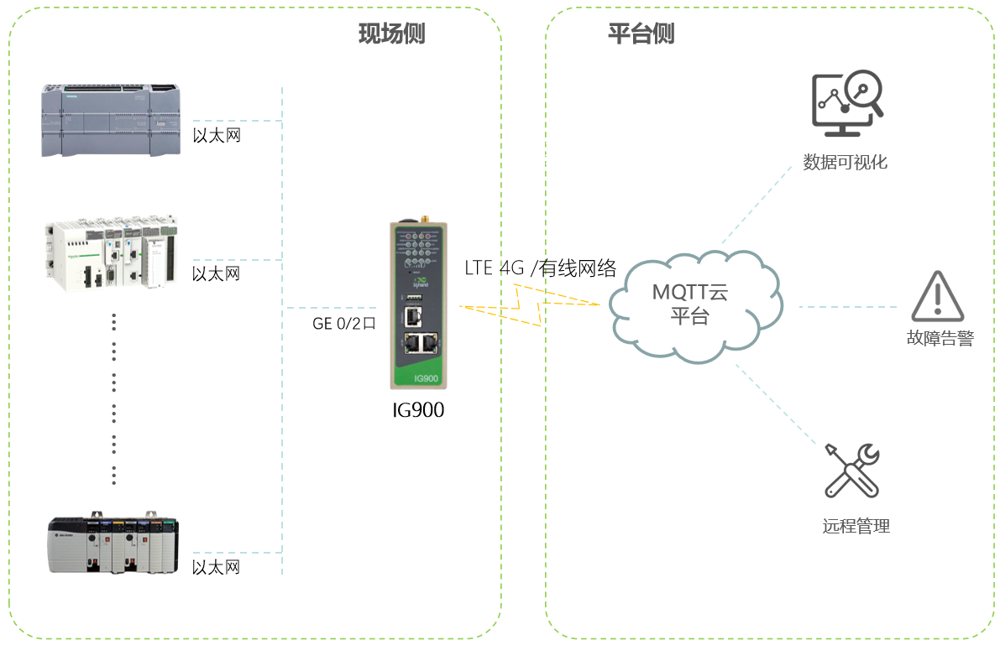  

- IG501以太网接线  
  
  接通IG501的电源并按照拓扑使用以太网线连接IG501和PLC。  

  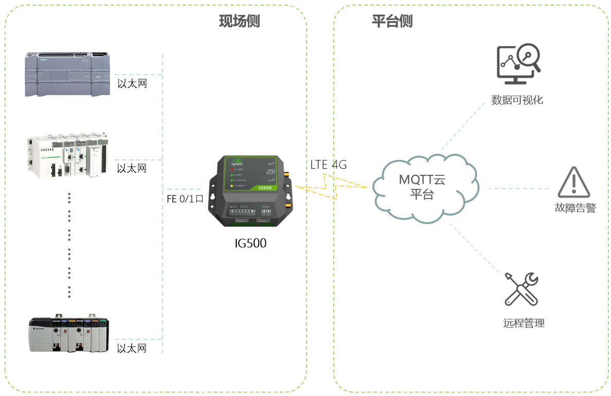  

<a id="串口接线"> </a>  

#### 1.1.2 串口接线
- IG902串口接线  

  接通IG902的电源并按照拓扑连接IG902和PLC。  

  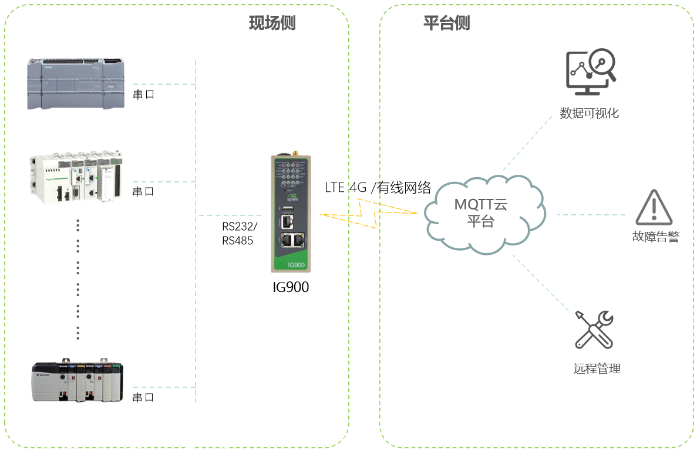  

  IG902串口端子接线说明如下图：  

    

- IG501串口接线  

  接通IG501的电源并按照拓扑连接IG501和PLC。  

  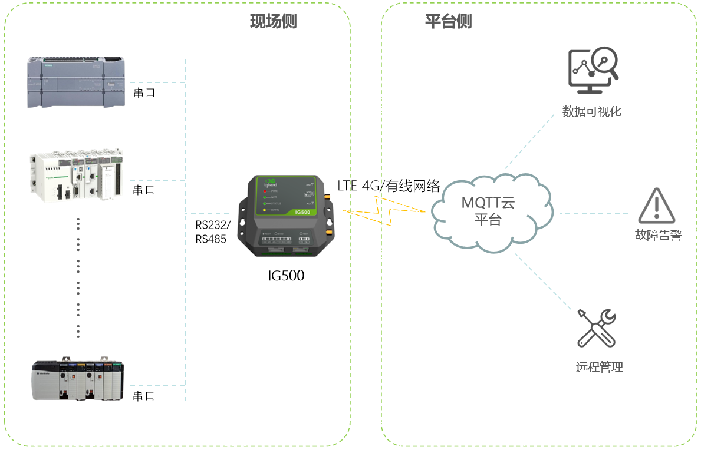  

  IG501串口端子接线说明如下图：  
  
  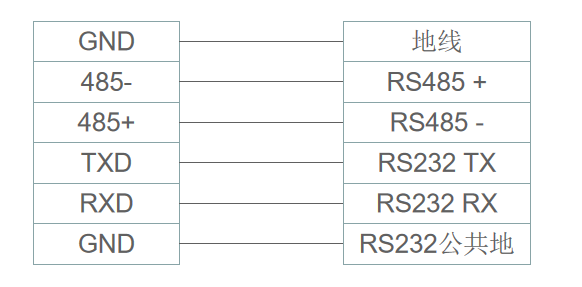
 
<a id="设置LAN网络参数"> </a>  

### 1.2 设置LAN网络参数：在局域网访问PLC
- IG902的GE 0/2口的默认IP地址为`192.168.2.1`。为了使IG902能够通过GE 0/2口访问以太网PLC，需要设置GE 0/2口与PLC处于同一网段，设置方法请参考[在局域网访问IG902](https://ingateway-development-docs.readthedocs.io/zh_CN/latest/IG902%E5%BF%AB%E9%80%9F%E4%BD%BF%E7%94%A8%E6%89%8B%E5%86%8C.html#lan-ig902)。
- IG501的FE 0/1口的默认IP地址为`192.168.1.1`。为了使IG501能够通过FE 0/1口访问以太网PLC，需要设置FE 0/1口与PLC处于同一网段，设置方法请参考[在局域网访问IG501](https://ingateway-development-docs.readthedocs.io/zh_CN/latest/IG501%E5%BF%AB%E9%80%9F%E4%BD%BF%E7%94%A8%E6%89%8B%E5%86%8C.html#lan-ig501)。

<a id="设置WAN网络参数"> </a>  

### 1.3 设置WAN网络参数：传输数据至MQTT服务器
- 设置IG902 WAN网络参数，请参考[IG902连接Internet](https://ingateway-development-docs.readthedocs.io/zh_CN/latest/IG902%E5%BF%AB%E9%80%9F%E4%BD%BF%E7%94%A8%E6%89%8B%E5%86%8C.html#wan-internet)。
- 设置IG501 WAN网络参数，请参考[IG501连接Internet](https://ingateway-development-docs.readthedocs.io/zh_CN/latest/IG501%E5%BF%AB%E9%80%9F%E4%BD%BF%E7%94%A8%E6%89%8B%E5%86%8C.html#wan-internet)。

<a id="更新InGateway设备软件版本"> </a>  

### 1.4 更新InGateway设备软件版本
如需获取InGateway产品最新软件版本及其功能特性信息，请联系客服。如需更新软件版本，请参考如下链接：
- [更新IG902软件版本](https://ingateway-development-docs.readthedocs.io/zh_CN/latest/IG902%E5%BF%AB%E9%80%9F%E4%BD%BF%E7%94%A8%E6%89%8B%E5%86%8C.html#id1)
  使用Device Supervisor时，IG902的固件版本应为`V2.0.0.r12537`及以上；SDK版本应为`py3sdk-V1.3.5`及以上。
- [更新IG501软件版本](https://ingateway-development-docs.readthedocs.io/zh_CN/latest/IG501%E5%BF%AB%E9%80%9F%E4%BD%BF%E7%94%A8%E6%89%8B%E5%86%8C.html#id1)

<a id="配置device_supervisor_app"> </a>  

## 2.配置Device Supervisor App

  - [2.1 安装并运行Device Supervisor](#安装并运行device_supervisor)
  - [2.2 Device Supervisor数据采集配置](#device_supervisor数据采集配置)


<a id="安装并运行device_supervisor"> </a>  

### 2.1 安装并运行Device Supervisor
- IG902如何安装并运行Python App请参考[IG902安装和运行Python App](https://ingateway-development-docs.readthedocs.io/zh_CN/latest/IG902%E5%BF%AB%E9%80%9F%E4%BD%BF%E7%94%A8%E6%89%8B%E5%86%8C.html#python-app)，Device Supervisor正常运行后如下图所示：  
  
    

- IG501如何安装并运行Python App请参考[IG501安装和运行Python App](https://ingateway-development-docs.readthedocs.io/zh_CN/latest/IG501%E5%BF%AB%E9%80%9F%E4%BD%BF%E7%94%A8%E6%89%8B%E5%86%8C.html#python-app)，Device Supervisor正常运行后如下图所示：  
  
    

<a id="device_supervisor数据采集配置"> </a>  

### 2.2 Device Supervisor数据采集配置

  - [2.2.1 添加PLC设备](#添加plc设备)
  - [2.2.2 添加变量](#添加变量)
  - [2.2.3 配置告警策略](#配置告警策略)
  - [2.2.4 配置分组](#配置分组)

<a id="添加plc设备"> </a>  

#### 2.2.1 添加PLC设备
- 添加ISO on TCP通讯的PLC设备  
  
  进入“边缘计算 > 设备监控 > 设备列表”页面，点击“添加PLC”按钮，在添加设备页面选择PLC协议为“ISO on TCP”并配置PLC的通讯参数。<font color=#FF0000>注意：设备名称不能重复。</font>  
  
  下图是添加S7-1500、S7-1200、S7-400、S7-300、S7-200 Smart系列PLC的示例（模式选择`Rack/Slot`）。除PLC为S7-200 Smart时机架号和槽号需要配置为0，1；其余类型的S7系列PLC默认使用0，0即可：

    

  下图是添加S7-200和西门子LOGO系列PLC的示例（模式选择`TSAP`）：

  

  添加成功后如下图所示：  

    

- 添加ModbusTCP通讯的PLC设备  
  
  进入“边缘计算 > 设备监控 > 设备列表”页面，点击“添加PLC”按钮，在添加设备页面选择PLC协议为“ModbusTCP”并配置PLC的通讯参数。（端口号和字节序默认为502和abcd；使用时需根据实际情况调整）<font color=#FF0000>注意：设备名称不能重复。</font>  

    

  添加成功后如下图所示：  

    

- 添加ModbusRTU通讯的PLC设备  
  
  进入“边缘计算 > 设备监控 > 设备列表”页面，点击“添加PLC”按钮，在添加设备页面选择PLC协议为“ModbusRTU”并配置PLC的通讯参数。<font color=#FF0000>注意：设备名称不能重复。</font>  

    

  添加成功后如下图所示：  

    

  如需修改RS232/RS485串口的通讯参数，请在“边缘计算 > 设备监控 > 全局参数”页面修改。修改后所有串口设备的通讯参数将自动修改并按照修改后的通讯参数通讯。  

  

<a id="添加变量"> </a>  

#### 2.2.2 添加变量
- 添加ISO on TCP变量  
  
  在“设备列表”页面点击“添加变量”按钮，在弹出框中配置变量参数：
  - `变量名`：变量名称<font color=#FF0000>（同一设备下变量名称不能重复）</font>    
  - `寄存器类型`：变量寄存器类型，包括`I/Q/M/DB`四种类型  
  - `DB索引`：寄存器类型为DB时变量的DB号  
  - `地址`：变量的寄存器地址  
  - `数据类型`：变量数据类型，包括：  
    - `BOOL`：True或False  
    - `BIT`：0或1  
    - `BYTE`：8位无符号数据  
    - `SINT`：8位有符号数据  
    - `WORD`：16位无符号数据  
    - `INT`：16位有符号数据  
    - `DWORD`：32位无符号数据  
    - `DINT`：32位有符号数据  
    - `FLOAT`：32位浮点数  
    - `STRING`：8位字符串  
    - `BCD`：16位BCD码  
  - `小数位`：数据类型为FLOAT时变量小数点后的数据长度，最大6位  
  - `长度`：数据类型为STRING时字符串长度，读取1个字符串的长度为1  
  - `位`：数据类型为BOOL或BIT时变量的位偏移，可输入0~7中任一数字  
  - `读写权限`：  
    - `Read`：只读，不可写  
    - `Write`：只写，不可读  
    - `Read/Write`：可读可写  
  - `采集模式`：  
    - `Realtime`：按照所属分组的采集间隔采集变量并按照上报间隔上报数据  
    - `Onchange`：变量数值有变化时才采集变量并按照上报间隔上报数据  
  - `单位`：变量单位  
  - `描述`：变量描述  
  - `所属分组`：变量所属的采集组  
   
  下图是添加一个地址为%I0.0的开关变量的例子：  

    

  下图是添加一个地址为%IB1的字节变量的例子：  
  
    

  下图是添加一个地址为%IW3的字变量的例子：  
  
    

  下图是添加一个地址为%ID4的双字变量的例子：  
  
    

  下图是添加一个地址为%DB6.DBD18的浮点数变量的例子：  
  
    

- 添加Modbus变量  
  
  在“设备列表”页面点击“添加变量”按钮，在添加变量弹出框中配置PLC变量参数：
  - 变量名：变量名称<font color=#FF0000>（同一设备下变量名称不能重复）</font>    
  - 地址：变量的寄存器地址  
  - 数据类型：变量数据类型，包括：  
    - BOOL：True或False  
    - BIT：0或1  
    - WORD：16位无符号数据  
    - INT：16位有符号数据  
    - DWORD：32位无符号数据  
    - DINT：32位有符号数据  
    - FLOAT：32位浮点数  
    - STRING：8位字符串   
  - 小数位：数据类型为FLOAT时变量小数点后的数据长度，最大6位  
  - 长度：数据类型为STRING时字符串长度  
  - 位：地址为`30001~40000`,`310001~365535`，`40001~50000`，`410001~465535`且数据类型为BOOL或BIT时变量的位偏移，可输入0~15中任一数字  
  - 读写权限：  
    - Read：只读，不可写  
    - Write：只写，不可读  
    - Read/Write：可读可写  
  - 采集模式：  
    - Realtime：按照固定采集间隔采集变量并按照上报间隔上报数据  
    - Onchange：变量数值变化后才采集并按照上报间隔上报数据  
  - 单位：变量单位  
  - 描述：变量描述  
  - 所属分组：变量所属的采集组  

  下图是添加一个地址为00001的线圈变量的例子：  
  
    

  下图是添加一个地址为10001的开关变量的例子：  
  
    

  下图是添加一个地址为30001的整数变量的例子：  
  
    

  下图是添加一个地址为40001的浮点数变量的例子：  
  
  

<a id="配置告警策略"> </a>

#### 2.2.3 配置告警策略

你可以进入“边缘计算 > 设备监控 > 告警 > 告警策略”页面配置告警策略，点击“添加”按钮后，在弹出框中配置告警策略参数。告警策略支持两种配置方式“使用新变量”和“引用已有变量”，参数如下：
- 使用新变量
  - `名称`：告警名称
  - `分组`：告警所属分组
  - `变量来源`：“使用新变量”即告警变量未在“设备列表”中配置，需要自行设置变量参数（该操作不会在“设备列表”中新增变量）
  - `设备`：告警变量所属设备
  - `地址`：告警变量地址
  - `数据类型`：告警变量数据类型
  - `告警条件`
    - `判断条件`：支持“=”、“!=”、“>”、“≥”、“<”、“≤”
    - `逻辑条件`
      - `无逻辑条件`：仅通过单个判断条件判断告警
      - `&&`：通过两个判断条件相与判断告警
      - `||`：通过两个判断条件相或判断告警
  - `描述`：告警描述

  下图是添加一个告警变量，该变量数值>30且<50时产生告警；不在此范围时不产生告警或告警消除。  

  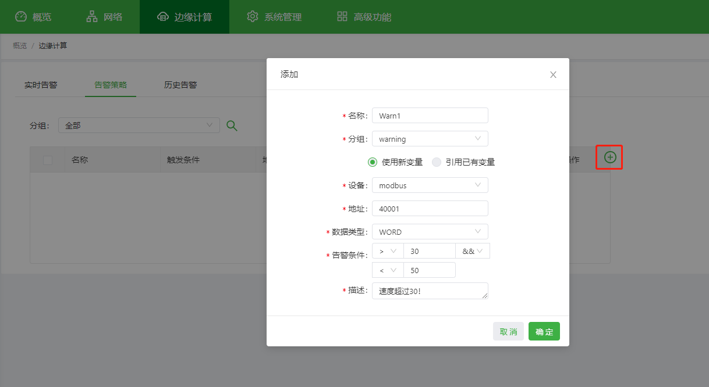  
  
- 引用已有变量
  - `名称`：告警名称
  - `分组`：告警所属分组
  - `变量来源`：“引用已有变量”即告警变量已在“设备列表”中配置，可以输入已有变量名称直接使用
  - `设备`：告警变量所属设备
  - `地址`：告警变量的地址
  - `告警条件`
    - `判断条件`：支持“=”、“!=”、“>”、“≥”、“<”、“≤”
    - `逻辑条件`
      - `无逻辑条件`：仅通过单个判断条件判断告警
      - `&&`：通过两个判断条件相与判断告警
      - `||`：通过两个判断条件相或判断告警
  - `描述`：告警描述

  下图是引用已有变量生成一条告警变量，该变量数值>30且<50时产生告警；不在此范围时不产生告警或告警消除。  

  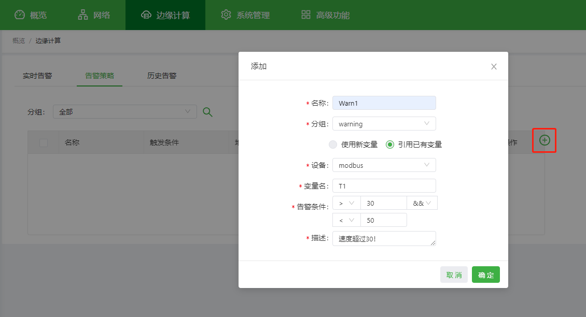  

<a id="配置分组"> </a>  

#### 2.2.4 配置分组
如需为变量或告警配置不同的采集间隔或需要按照不同的MQTT主题上报相应的变量数据时，可在“边缘计算 > 设备监控 > 分组”页面添加新分组。  

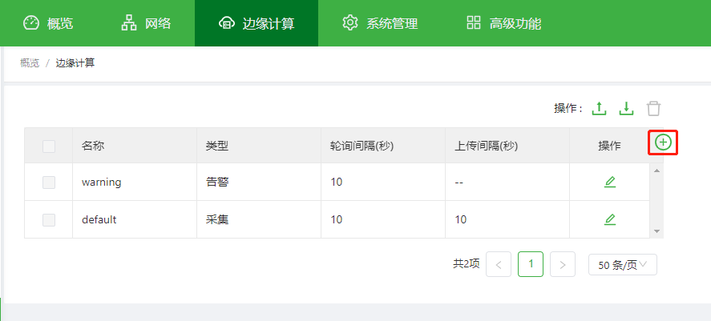

- 添加采集分组  
  
  下图添加了一个名为“group2”的采集分组，该采集分组每5秒采集一次分组中的变量：  

  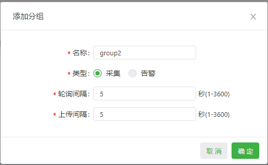  

  添加采集分组后，添加变量时可以选择将变量关联到该分组或者在变量列表中选择需要关联的变量添加到指定分组中，分组中的变量会按照分组的采集间隔采集数据。  

    

  

- 添加告警分组  
  
  下图添加了一个名为warn_group2的告警分组，该告警分组每5秒检测一次分组中的告警变量是否处于告警状态：  

  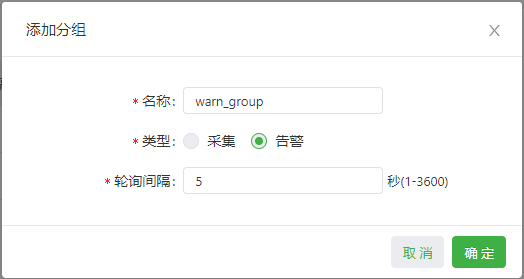
  
  添加告警分组后，添加告警策略时可以选择将告警策略关联到该分组或者在告警列表中选择需要关联的告警策略添加到指定分组中，分组中的告警策略会按照分组的采集间隔检测变量告警状态。 
  
  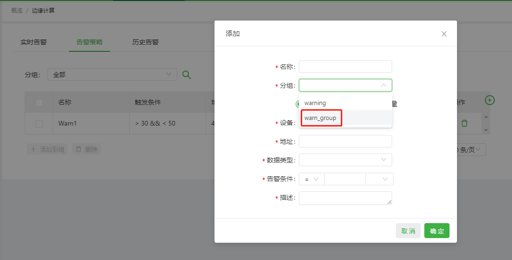  

  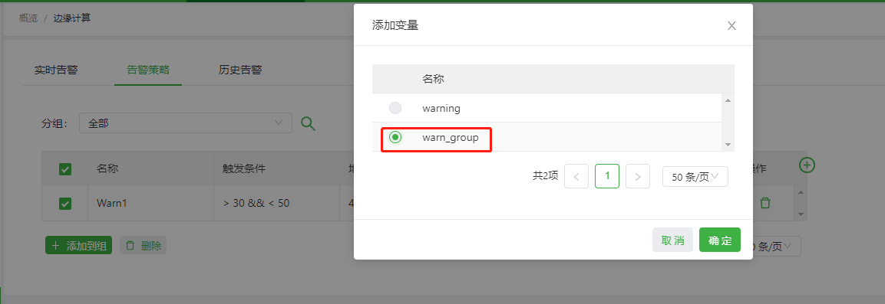  
  
<a id="监控plc数据"> </a>  

## 3.监控PLC数据 
  
  - [3.1 本地监控PLC数据](#本地监控plc数据)
  - [3.2 在Thingsboard上监控PLC数据](#在thingsboard上监控plc数据)

<a id="本地监控plc数据"> </a>  

### 3.1 本地监控PLC数据

  - [3.1.1 本地监控数据采集](#本地监控数据采集)
  - [3.1.2 本地监控告警](#本地监控告警)

<a id="本地监控数据采集"> </a>  

#### 3.1.1 本地监控数据采集
数据采集配置完成后，可以在“边缘计算 > 设备监控 > 设备列表”页面查看数据采集情况。点击设备列表中的设备卡片可切换需要查看的PLC数据。  

  

点击数值栏的按钮可进行写入操作。  

  

  

修改成功如下图所示：  


<a id="本地监控告警"> </a>  

#### 3.1.2 本地监控告警
告警策略配置完成后，可以在“边缘计算 > 设备监控 > 告警”页面查看变量告警情况。
- 实时告警：查看当前未消除的告警信息

    
  
- 历史告警：筛选查看任意告警信息
  
  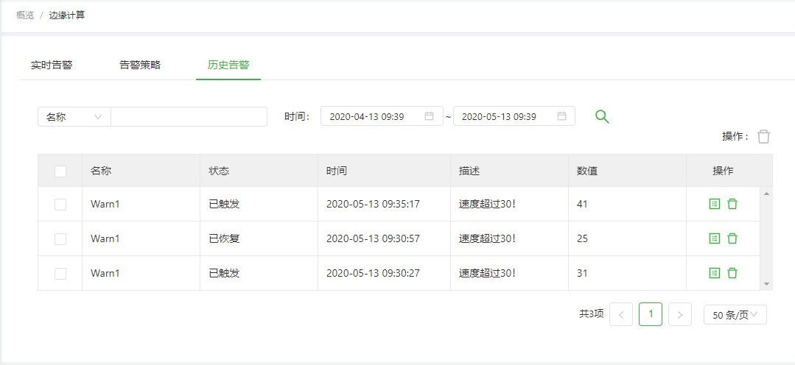  
  
<a id="在thingsboard上监控plc数据"> </a>  

### 3.2 在Thingsboard上监控PLC数据

  - [3.2.1 配置Thingsboard](#配置thingsboard)
  - [3.2.2 配置云服务](#配置云服务)

<a id="配置thingsboard"> </a>  

#### 3.2.1 配置Thingsboard
Thingsboard的详细使用方法请查看[Thingsboard入门手册](https://thingsboard.io/docs/getting-started-guides/helloworld/)，您也可以按照[Thingsboard参考流程](#thingsboard参考流程)进行测试。

<a id="配置云服务"> </a>  

#### 3.2.2 配置云服务
进入“边缘计算 > 设备监控 > 云服务”页面，勾选启用云服务并配置相应的MQTT连接参数，配置完成后点击提交。
- `服务器地址`：Thingsboard的demo地址为`demo.thingsboard.io`
- `端口号`：默认为`1883`
- `MQTT客户端ID`：任一唯一ID
- `MQTT用户名`：Thingsboard设备的访问令牌，访问令牌获取方式见[传输PLC数据到Thingsboard设备](#传输plc数据到thingsboard设备)
- MQTT密码：任意6~32位密码
- 其余项使用默认配置即可  

配置完成后如下图所示：  


提交后点击“高级设置”以配置发布和订阅主题。发布和订阅主题的配置方法请参考[高级设置（自定义MQTT发布/订阅）](#高级设置自定义mqtt发布订阅)。以下是示例配置：
- 发布主题：
  - `主题`：`v1/devices/me/telemetry`
  - `Qos(MQTT)`：`1`
  - `分组类型`：`采集`
  - `分组`：需要上传数据至thingsboard的分组名称，本文档为`default`
  - `主函数`：入口函数名称，本文档为`upload_test`
  - `脚本`：
    ```python
    from common.Logger import logger #导入打印日志模块logger
    
    def upload_test(data, wizard_api): #定义主函数upload_test
        logger.info(data) #在日志中以info等级打印采集到的数据
        value_dict = {} #定义上报的数据字典value_dict
        for device, val_dict in data['values'].items(): #遍历data中的values字典，该字典中包含设备名称和设备下的变量数据
            for id, val in val_dict.items(): #遍历变量数据，为value_dict字典赋值
                value_dict[id] = val["raw_data"]
            value_dict["timestamp"] = data["timestamp"]
        logger.info(value_dict) #在日志中以info等级打印value_dict
        return value_dict #将value_list发送给App，由App自行顺序上传至MQTT服务器。最终的value_list格式为{'bool': False, 'byte': 7, 'real': 0.0, 'timestamp': 1583990892.5429199}
    ```
  配置完成后如下图所示：  

  

- 订阅主题
  - `主题`：`v1/devices/me/rpc/request/+`
  - `Qos(MQTT)`：`1`
  - `主函数`：入口函数名称，本文档为`ctl_test`
  - `脚本`：
    ```python
    from common.Logger import logger #导入打印日志模块logger
    import json #导入json模块
    
    def ctl_test(topic, payload, wizard_api): #定义主函数ctl_test
        logger.info(topic) #打印订阅主题
        logger.info(payload) #打印订阅数据，Thingsboard的下发数据格式为{"method":"setValue","params":true}
        payload = json.loads(payload) #反序列化订阅数据
        if payload["method"] == "setValue": #检测是否为写入数据
            message = {"bool":payload["params"]} #定义修改变量值消息，包括变量名称和变量值
            ack_tail = [topic.replace('request', 'response'), message] #定义确认数据，包括响应的主题和消息
            wizard_api.write_plc_values(message, ack, ack_tail) #调用write_plc_values方法，将message字典中的数据下发至指定变量；调用ack方法并发送ack_tail给ack方法
    
    
    def ack(data, ack_tail, wizard_api): #定义ack方法
        resp_topic = ack_tail[0] #定义响应主题
        resp_data = ack_tail[1] #定义响应数据
        wizard_api.mqtt_publish(resp_topic, json.dumps(resp_data), 1) #调用mqtt_publish将响应数据发送给MQTT服务器，响应数据格式为{'bool': True}
    ```

  配置完成后如下图所示：  

  

<a id="附录"> </a>  

## 附录

  - [导入导出配置](#导入导出配置)
  - [高级设置（自定义MQTT发布/订阅）](#高级设置自定义mqtt发布订阅)
  - [全局参数](#全局参数)
  - [其他网关操作](#其他网关操作)
  - [Thingsboard参考流程](#thingsboard参考流程)

<a id="导入导出配置"> </a>  

### 导入导出配置
Device Supervisor的数据采集配置总共包含三个CSV格式的配置文件，您可以通过导入导出配置文件快速实现采集配置。各配置文件内容如下：
- device.csv：设备配置文件,详细参数如下
  - `Device Name`：设备名称
  - `Protocol`：通讯协议名称，如`ModbusTCP`
  - `Ip/Serial`：以太网设备填写ip地址；串口设备填写`RS485`或`RS232`
  - `Port`：以太网设备的通讯端口号
  - `Rack`（仅ISO on TCP设备）：设备机架号
  - `Slot`（仅ISO on TCP设备）：设备槽号
  - `Mode`（仅ISO on TCP设备）：ISO on TCP模式，包括`TSAP`和`Rack/Slot`
  - `Slave`（仅Modbus设备）：从站地址
  - `Byte Order`（仅Modbus设备）：字节序，包括`abcd`、`badc`、`cdab`、`dcba`  

  导出方式为设备列表页面的设备列表导出。  

    

  示例配置如下：  

    
  
- var.csv:变量配置文件，详细参数如下
  - `Var Name`：变量名称
  - `Device`：变量所属设备
  - `Protocol`：通讯协议名称
  - `Dbnumber`（仅ISO on TCP设备）：DB号
  - `Register Type`（仅ISO on TCP设备）：寄存器类型，如`DB`
  - `Register Addr`：寄存器地址
  - `Register Bit`：位偏移
  - `Data Type`：数据类型
  - `Read Write`：读写权限，包括`Read/Write`、`Write`、`Read`
  - `Float Repr`：小数位，`1~6`
  - `Mode`：采集模式，包括`realtime`、`onchange`
  - `Unit`：单位
  - `Size`：字符串长度
  - `Desc`：描述
  - `Group`：所属分组  

  导出方式为设备列表页面的变量列表导出。  

    

  示例配置如下：  

    
  
- group.csv:分组配置文件，详细参数如下
  - `Group Name`：分组名称
  - `Polling Interval`：采集间隔
  - `Upload Interval`：上传间隔。分组类型为`alarm`时此项为空即可  
  - `Group Type`：分组类型，支持`alarm`和`collect`

  导出方式为分组页面的分组导出。  

    

  示例配置如下：  

  

<a id="高级设置自定义mqtt发布订阅"> </a>  

### 高级设置（自定义MQTT发布/订阅）
您可以在“边缘计算 > 设备监控 > 云服务”配置你的MQTT连接参数，并支持通过高级设置功能配置上报数据的MQTT主题、数据来源等参数并支持使用Python语言自定义MQTT发布和订阅主题的数据上报、处理等逻辑。无需二次开发即可实现与多种MQTT服务器进行数据上传和下发。以下将为您说明“高级设置”的使用方法。  

  - [发布](#发布)
  - [订阅](#订阅)
  - [Device Supervisor的api接口说明](#device_supervisor_api_description)
  - [回调函数说明](#callback-function-description)

<a id="发布"> </a>  

#### 发布
自定义发布主题中包含以下配置项：
- `名称`：用户自定义发布名称
- `主题`：发布主题，与MQTT服务器订阅的主题保持一致
- `Qos(MQTT)`：发布Qos，建议与MQTT服务器的Qos保持一致
  - `0`：只发送一次消息，不进行重试  
  - `1`：最少发送一次消息，确保消息到达MQTT服务器
  - `2`：确保消息到达MQTT服务器且只收到一次
- `分组类型`：发布变量数据时请选择“采集”，随后在`分组`中仅能选择“采集组”；发布告警数据时请选择“告警”，随后在`分组`中仅能选择“告警组”
- `分组`：选择相应的分组后，分组下所有变量通过该发布配置将数据上传至MQTT服务器（可选择多个分组）
- `主函数`：主函数名称，即入口函数名称，与脚本中的入口函数名称保持一致
- `脚本`：使用Python代码自定义组包和处理逻辑，发布中的主函数参数包括：
  - `参数1`：Device Supervisor将采集后的变量数据发送给该参数，数据格式如下：  
    - 变量数据格式：
      ```python
      {
          'timestamp': 1589434519.5458372,  #数据产生时间戳
          'group_name': 'default'  #采集组名称
          'values':  #变量数据字典，包含PLC名称，变量名称和变量值
          {
              'S7-1200':  #PLC名称
              {
                  'Test1':  #变量名称
                  {
                      'raw_data': False,  #变量值
                      'status': 1  #采集状态，非1即采集异常
                  },
                  'Test2':
                  {
                      'raw_data': 2,
                      'status': 1
                  }
              }
          },
      }
      ```

    - 告警数据格式：  
      ```python
      {
          'timestamp': 1589434527.3628697,  #告警产生时间戳
          'group_name': 'warning'  #告警组名称
          'values':  #告警数据字典，包含告警名称等告警信息
          {
              'Warn1':  #告警名称
              {
                  'timestamp': 1589434527,  #告警产生时间戳
                  'current': 'on',  #告警状态。on:已触发，off:已消除
                  'status': 0,  #告警状态。0:已触发，1:已消除
                  'value': 33,  #告警触发时告警变量的数值
                  'alarm_content': '速度超过30！',  #告警描述
                  'level': 1  #预留字段
              }
          },
      }
      ```  

  - `参数2`：该参数为Device Supervisor提供的api接口，参数说明见[Device Supervisor的api接口说明](#device_supervisor_api_description)  

以下是常见的自定义发布方法示例<font color=#FF0000>（请勿将`mqtt_publish`或`save_data`方法与`return`命令同时使用）</font>：

<a id="pub-example1"> </a>

- 发布示例1：使用`return`方式上传变量数据  
  
  本示例实现了使用`return`方式上传变量数据时，将处理后的变量数据使用`return`命令发送给Device Supervisor。Device Supervisor自行根据发布中配置的主题和Qos将变量数据按照采集时间顺序上传至MQTT服务器。如果发送失败则缓存变量数据等待MQTT连接正常后按采集时间顺序上传至MQTT服务器。发布和代码配置示例如下：  
    
    

  ```python
  import logging
  """
  在网关中打印日志通常有两种办法。
  1.import logging：使用logging.info(XXX)打印日志，该方法的日志显示不受全局参数页面中的日志等级参数控制。
  2.from common.Logger import logger：使用logger.info(XXX)打印日志，该方法的日志显示受全局参数页面中的日志等级参数控制。
  """
  
  def vars_upload_test(data_collect, wizard_api): #定义发布主函数
      value_list = [] #定义数据列表
      for device, val_dict in data_collect['values'].items(): #遍历values字典，该字典中包含设备名称和设备下的变量数据
          value_dict = { #自定义数据字典
                        "Device": device,
                        "timestamp": data_collect["timestamp"],
                        "Data": {}
                        }
          for id, val in val_dict.items(): #遍历变量数据，为Data字典赋值
              value_dict["Data"][id] = val["raw_data"]
          value_list.append(value_dict) #依次将value_dict添加到value_list中
      logging.info(value_list) #在App日志中打印value_list，数据格式为[{'Device': 'S7-1200', 'timestamp': 1589538347.5604711, 'Data': {'Test1': False, 'Test2': 12}}]
      return value_list #将value_list发送给App，App将自行按照采集时间顺序上传至MQTT服务器。如果发送失败则缓存数据等待连接恢复后按采集时间顺序上传至MQTT服务器
    ```  

<a id="pub-example2"> </a>

- 发布示例2：使用`return`方式上传告警数据  
  
  本示例实现了上传告警数据。发布和代码配置示例如下：  

    

  ```python
  import logging
  """
  在网关中打印日志通常有两种办法。
  1.import logging：使用logging.info(XXX)打印日志，该方法的日志显示不受全局参数页面中的日志等级参数控制。
  2.from common.Logger import logger：使用logger.info(XXX)打印日志，该方法的日志显示受全局参数页面中的日志等级参数控制。
  """
  
  def alarms_upload_test(data_collect, wizard_api): #定义发布主函数
      alarm_list = [] #定义告警列表
      for alarm_name, alarm_info in data_collect['values'].items(): #遍历values字典，该字典中包含告警名称和告警时间等信息
          alarm_dict = { #自定义数据字典
                        "Alarm_name": alarm_name,
                        "timestamp": data_collect["timestamp"],
                        "Alarm_status": alarm_info['current'],
                        "Alarm_value": alarm_info['value'],
                        "Alarm_content": alarm_info['alarm_content']
                        }
          alarm_list.append(alarm_dict) #依次将alarm_dict添加到alarm_list中
      logging.info(alarm_list) #在App日志中打印alarm_list
      return alarm_list #将alarm_list发送给App，App将自行按照采集时间顺序上传至MQTT服务器。如果发送失败则缓存数据等待连接恢复后按时间顺序上传至MQTT服务器
  ```

<a id="pub-example3"> </a>

- 发布示例3：使用`mqtt_publish`上传变量数据并使用`save_data`存储上传失败的变量数据  
  
  本示例实现了使用`mqtt_publish`方法将变量数据上传至MQTT服务器，当MQTT连接异常导致变量数据上传失败时，使用`save_data`方法存储主题、qos和变量数据至数据库，存储的变量数据会在MQTT连接正常时按照先存先传的方式通过存储数据中的主题和Qos上传至MQTT服务器。发布和代码配置示例如下：  

    

  ```python
  from common.Logger import logger
  import json
  from datetime import datetime
  """
  在网关中打印日志通常有两种办法。
  1.import logging：使用logging.info(XXX)打印日志，该方法的日志显示不受全局参数页面中的日志等级参数控制。
  2.from common.Logger import logger：使用logger.info(XXX)打印日志，该方法的日志显示受全局参数页面中的日志等级参数控制。
  """
  
  def vars_cache_test(data_collect, wizard_api): #定义发布主函数
      value_list = [] #定义数据列表
      utc_time = datetime.utcfromtimestamp(data_collect["timestamp"]) #转换LINUX时间戳为UTC时间
      for device, val_dict in data_collect['values'].items(): #遍历values字典，该字典中包含设备名称和设备下的变量数据
          value_dict = { #自定义数据字典
                        "DeviceSN": device,
                        "Time": utc_time.strftime('%Y-%m-%dT%H:%M:%S.%fZ'),
                        "Data": {}
                         }
          for id, val in val_dict.items(): #遍历变量数据，为Data字典赋值
              value_dict["Data"][id] = val["raw_data"]
          value_list.append(value_dict) #依次将value_dict添加到value_list中
      if not wizard_api.mqtt_publish("v1/xxx/yyy", json.dumps(value_list), 1): #调用wizard_api模块中的mqtt_publish方法将value_list数据通过主题“v1/xxx/yyy”，qos等级1发送至MQTT服务器并检测是否发送成功
          value_list = {"topic": "v1/xxx/yyy", "qos": 1, "payload": value_list}
          wizard_api.save_data(value_list) #发送失败则存储数据，等待连接恢复后将按时间顺序上传存储数据
          logger.info("Save data:%s" %value_list)
      logger.info(value_list) #在App日志中打印value_list
  ```

<a id="pub-example4"> </a>

- 发布示例4：使用`mqtt_publish`上传变量数据并使用`save_data`存储上传失败的变量数据  
  
  本示例实现了使用`mqtt_publish`方法将变量数据上传至MQTT服务器，当MQTT连接异常导致变量数据上传失败时，使用`save_data`方法存储变量数据和分组名称，存储的变量数据会在MQTT连接正常时按照先存先传的方式将变量数据按照分组在云服务中关联的主题和Qos上传至MQTT服务器<font color=#FF0000>（请勿将`mqtt_publish`或`save_data`方法与`return`命令同时使用）</font>。发布和代码配置示例如下： 

    

  ```python
  from common.Logger import logger
  import json
  from datetime import datetime
  """
  在网关中打印日志通常有两种办法。
  1.import logging：使用logging.info(XXX)打印日志，该方法的日志显示不受全局参数页面中的日志等级参数控制。
  2.from common.Logger import logger：使用logger.info(XXX)打印日志，该方法的日志显示受全局参数页面中的日志等级参数控制。
  """
  
  def vars_cache_test(data_collect, wizard_api): #定义发布主函数
      value_list = [] #定义数据列表
      utc_time = datetime.utcfromtimestamp(data_collect["timestamp"]) #转换LINUX时间戳为UTC时间
      for device, val_dict in data_collect['values'].items(): #遍历values字典，该字典中包含设备名称和设备下的变量数据
          value_dict = { #自定义数据字典
                        "DeviceSN": device,
                        "Time": utc_time.strftime('%Y-%m-%dT%H:%M:%S.%fZ'),
                        "Data": {}
                         }
          for id, val in val_dict.items(): #遍历变量数据，为Data字典赋值
              value_dict["Data"][id] = val["raw_data"]
          value_list.append(value_dict) #依次将value_dict添加到value_list中
      if not wizard_api.mqtt_publish("v1/xxx/yyy", json.dumps(value_list), 1): #调用wizard_api模块中的mqtt_publish方法将value_list数据通过主题“v1/xxx/yyy”，qos等级1发送至MQTT服务器并检测是否发送成功
          wizard_api.save_data(value_list,'default') #发送失败则存储数据，等待连接恢复后将按时间顺序上传存储数据
          logger.info("Save data:%s" %value_list)
      logger.info(value_list) #在App日志中打印value_list
  ```

<a id="pub-example5"> </a>

- 发布示例5：使用`get_tag_config`获取设备、变量和告警点表  
  
  本示例实现了每次重启App时使用`get_tag_config`方法获取设备、变量和告警点表并分别上传至MQTT服务器。发布和代码配置示例如下：  
  
  

  ```python
  from common.Logger import logger
  import json
  """
  在网关中打印日志通常有两种办法。
  1.import logging：使用logging.info(XXX)打印日志，该方法的日志显示不受全局参数页面中的日志等级参数控制。
  2.from common.Logger import logger：使用logger.info(XXX)打印日志，该方法的日志显示受全局参数页面中的日志等级参数控制。
  """
  
  IS_UPLOAD_CONFIG = True  #定义变量用于判断是否需要获取并上传点表
  
  def upload_tagconfig(recv, wizard_api):  #定义发布主函数
      global IS_UPLOAD_CONFIG  #声明变量为全局变量
      if IS_UPLOAD_CONFIG:  #判断是否需要获取并上传点表
          wizard_api.get_tag_config(tagconfig)  #调用wizard_api模块中的recall_data方法，定义该方法的回调函数名称为tagconfig
          IS_UPLOAD_CONFIG = False  #获取并上传点表后不再上传点表
  
  def tagconfig(config, tail, wizard_api): #定义获取点表的回调函数tagconfig
      logger.info(config) #打印点表信息，包含设备、分组、变量和告警点表
      deviceConfiguration_list = [] #定义设备点表列表
      for device in config['devices']: #遍历设备点表
          deviceInfo = {} #定义设备信息字典
          if device['protocol'] == "ModbusTCP": #判断设备通讯协议是否为ModbusTCP
              deviceInfo["Device"] = device['device_name']
              deviceInfo["PLCProtocol"] = device['protocol']
              deviceInfo["IP Address"] = device['ip']
              deviceInfo["Port"] = device['port']
              deviceInfo["SlaveAddress"] = device['slave']
              deviceInfo["Endian"] = device['byte_order']
              deviceConfiguration_list.append(deviceInfo) #依次将deviceInfo添加到deviceConfiguration_list中
          elif device['protocol'] == "ModbusRTU": #判断设备通讯协议是否为ModbusRTU
              deviceInfo["Device"] = device['device_name']
              deviceInfo["PLCProtocol"] = device['protocol']
              deviceInfo["Port"] = device['serial']
              deviceInfo["Baudrate"] = device['baudrate']
              deviceInfo["DataBits"] = device['bytesize']
              deviceInfo["Parity"] = device['parity']
              deviceInfo["StopBits"] = device['stopbits']
              deviceInfo["SlaveAddress"] = device['slave']
              deviceInfo["Endian"] = device['byte_order']
              deviceConfiguration_list.append(deviceInfo)
          elif device['protocol'] == "ISO-on-TCP": #判断设备通讯协议是否为ISO-on-TCP
              deviceInfo["Device"] = device['device_name']
              deviceInfo["PLCProtocol"] = device['protocol']
              deviceInfo["IP Address"] = device['ip']
              deviceInfo["Port"] = device['port']
              deviceInfo["Rack"] = device['rack']
              deviceInfo["Slot"] = device['slot']
              deviceConfiguration_list.append(deviceInfo)
      logger.info(deviceConfiguration_list)
      wizard_api.mqtt_publish("Config/DeviceInfo", json.dumps(deviceConfiguration_list), 1) #调用wizard_api模块中的mqtt_publish方法将deviceConfiguration_list数据通过主题“Config/DeviceInfo”，qos等级1发送至MQTT服务器
  
  
      tagConfiguration_list = [] #定义变量点表列表
      device_group_info_dict = {} #定义设备下的分组信息字典
      group_info_dict = {} #定义分组信息字典
      for groupinfo in config['groups']: #遍历点表中的分组
          group_info_dict[groupinfo["group_name"]] = groupinfo #建立组名与分组信息的对应关系
      for device in config['devices']: #遍历点表中的设备
          group_list= [] #定义设备下的分组列表
          for var in config['vars']: #遍历点表中的变量
              if device['device_name'] == var['device'] and var['group'] not in group_list: #判断设备下存在变量，且该变量所属的分组未存在与group_list中，则将该分组添加到group_list中
                  group_list.append(var['group'])
          device_group_info_dict[device['device_name']] = group_list #建立设备与设备下的分组列表的对应关系
      for device, group_list in device_group_info_dict.items(): #遍历设备下的分组信息字典
          if group_list == []: #如果设备下的分组列表为空，即该设备下未定义变量，则跳过该设备
              continue
          tagConfiguration = {} #定义变量点表字典
          tagConfiguration["Device"] = device #添加设备信息
          tagConfiguration["Collections"] = []
          for group in group_list: #遍历设备下的分组并添加分组信息
              group_info = {}
              group_info["CollectionName"] = group
              group_info["SampleRate"] = group_info_dict[group]["polling_interval"]
              group_info["PublishInterval"] = group_info_dict[group]["upload_interval"]
              group_info["TagData"] = []
              tagConfiguration["Collections"].append(group_info)
              for var in config['vars']: #遍历点表中的变量
                  if var['device'] != device or var['group'] != group: #如果该变量不属于当前设备和分组，则跳过该变量
                      continue
                  index_number = tagConfiguration["Collections"].index(group_info) #获取该分组在tagConfiguration["Collections"]中的索引
                  data_info = {} #定义变量信息字典
                  data_info["Tag"] = var["var_name"]
                  data_info["Address"] = var["address"]
                  data_info["ValueType"] = var["data_type"]
                  data_info["AccessLevel"] = var["read_write"]
                  data_info["Mode"] = var["mode"]
                  data_info["Unit"] = var["unit"]
                  data_info["Description"] = var["desc"]
                  tagConfiguration["Collections"][index_number]["TagData"].append(data_info) #将变量信息添加至指定分组的TagData中
          tagConfiguration_list.append(tagConfiguration) #依次将设备点表添加至tagConfiguration_list中
      logger.info(tagConfiguration_list) #打印变量点表
      for tagConfiguration in tagConfiguration_list: #遍历每个设备下的变量点表并依次上传至MQTT服务器
          wizard_api.mqtt_publish("Config/TagConfiguration", json.dumps(tagConfiguration), 1) #调用wizard_api模块中的mqtt_publish方法将tagConfiguration_list中的数据依次通过主题“Config/TagConfiguration”，qos等级1发送至MQTT服务器
  
  
      alarmConfiguration_list = [] #定义告警点表
      for alarm in config['warning']: #遍历点表中的告警
          alarmInfo = {} #定义告警信息字典
          alarmInfo['Warn_name'] = alarm['warn_name']
          alarmInfo['Group'] = alarm['group']
          alarmInfo['Alarm_content'] = alarm['alarm_content']
          alarmInfo['Condition1'] = alarm['condition1']
          alarmInfo['Operand1'] = alarm['operand1']
          alarmInfo['Combine_method'] = alarm['combine_method']
          alarmInfo['Condition2'] = alarm['condition2']
          alarmInfo['Operand2'] = alarm['operand2']
          alarmInfo['Device'] = alarm['device']
          alarmInfo['Var_name'] = alarm['var_name']
          alarmInfo['Address'] = alarm['address']
          alarmConfiguration_list.append(alarmInfo) #依次将告警信息添加至alarmConfiguration_list中
      logger.info(alarmConfiguration_list) #打印告警点表
      wizard_api.mqtt_publish("Config/AlarmInfo", json.dumps(alarmConfiguration_list), 1) #调用wizard_api模块中的mqtt_publish方法将alarmConfiguration_list数据通过主题“Config/AlarmInfo”，qos等级1发送至MQTT服务器
  ```

<a id="pub-example6"> </a>

- 发布示例6：使用`get_global_parameter`获取全局参数设置  
  
  本示例实现了获取“全局参数”中设置的参数`device_id`，并通过通配符`${device_id}`的配置方式配置MQTT主题。发布和代码配置示例如下：  

    

    

  ```python
  import logging
  """
  在网关中打印日志通常有两种办法。
  1.import logging：使用logging.info(XXX)打印日志，该方法的日志显示不受全局参数页面中的日志等级参数控制。
  2.from common.Logger import logger：使用logger.info(XXX)打印日志，该方法的日志显示受全局参数页面中的日志等级参数控制。
  """
  
  def vars_upload_test(data_collect, wizard_api): #定义发布主函数
      global_parameter = wizard_api.get_global_parameter() #定义全局参数变量
      logging.info(global_parameter) #打印全局参数变量
      value_list = [] #定义数据列表
      for device, val_dict in data_collect['values'].items(): #遍历values字典，该字典中包含设备名称和设备下的变量数据
          value_dict = { #自定义数据字典
                        "Device": device,
                        "DeviceID": global_parameter["device_id"], #获取全局变量中定义的设备ID
                        "timestamp": data_collect["timestamp"],
                        "Data": {}
                        }
          for id, val in val_dict.items(): #遍历变量数据，为Data字典赋值
              value_dict["Data"][id] = val["raw_data"]
          value_list.append(value_dict) #依次将value_dict添加到value_list中
      logging.info(value_list) #在App日志中打印value_list，数据格式为[{'Device': 'S7-1200', 'DeviceID': '1', 'timestamp': 1589538347.5604711, 'Data': {'Test1': False, 'Test2': 12}}]
      return value_list #将value_list发送给App，App将自行按照采集时间顺序上传至MQTT服务器。如果发送失败则缓存数据等待连接恢复后按时间顺序上传至MQTT服务器
  ```

<a id="订阅"> </a>  

#### 订阅
自定义订阅中包含以下项：
- `名称`：自定义订阅名称
- `主题`：订阅主题，与MQTT服务器发布的数据主题保持一致
- `Qos(MQTT)`：订阅Qos，建议与MQTT服务器的Qos保持一致
- `主函数`：主函数名称，即入口函数名称，与脚本中的入口函数名称保持一致
- `脚本`：使用Python代码自定义组包和处理逻辑，订阅中的主函数参数包括：
  - `参数1`：该参数为接收到的主题，数据类型为`string`
  - `参数2`：该参数为接收到的数据，数据类型为`string`
  - `参数3`：该参数为Device Supervisor提供的api接口，参数说明见[Device Supervisor的api接口说明](#device_supervisor_api_description)  

以下是三个常见的自定义订阅方法示例：

<a id="sub-example1"> </a>

- 订阅示例1：下发变量名称和变量值写入PLC数据且不返回写入结果  
  
  本示例实现了从MQTT服务器下发指定命令修改变量数值，发布和代码配置示例如下：  

    

  ```python
  import logging
  import json
  
  def ctl_test(topic, payload, wizard_api): #定义订阅主函数
      logging.info(topic) #打印订阅主题,假定topic为write/plc
      logging.info(payload) #打印订阅数据,假定payload数据为{"method":"setValue", "TagName":"SP1", "TagValue":12.3}
      payload = json.loads(payload) #反序列化订阅数据
      if payload["method"] == "setValue": #检测是否为写入数据
          message = {payload["TagName"]:payload["TagValue"]} #定义下发消息，包括下发的变量名称和变量值
          wizard_api.write_plc_values(message) #调用wizard_api模块中的write_plc_values方法，将message字典中的数据下发至指定变量
  ```

<a id="sub-example2"> </a>

- 订阅示例2：下发设备名称，变量名称和变量值写入PLC数据且不返回写入结果  
  
  本示例实现了从MQTT服务器下发指定命令修改变量数值，发布和代码配置示例如下：  

    

  ```python
  import logging
  import json
  
  def ctl_test(topic, payload, wizard_api): #定义订阅主函数
      logging.info(topic) #打印订阅主题
      logging.info(payload) #打印订阅数据
      #假定payload数据为{"method":"setValue","Device":"Modbus_test", "TagName":"SP1", "TagValue":12.3}
      payload = json.loads(payload) #反序列化订阅数据
      data_dict = {payload["TagName"]:payload["TagValue"]} #定义下发的数据字典，包含下发的变量名称和变量值
      var_device = payload["Device"] #定义设备名称
      if payload["method"] == "setValue": #检测是否为写入数据
          message = {var_device:data_dict} #定义下发消息，包括设备名称和下发的数据字典
          wizard_api.write_plc_values(message) #调用wizard_api模块中的write_plc_values方法，将message字典中的数据下发至指定变量
  ```

<a id="sub-example3"> </a>

- 订阅示例3：写入变量数据并返回写入结果  
  
  本示例实现了从MQTT服务器下发指定命令修改变量数值并返回修改结果，发布和代码配置示例如下：  

    

  ```python
  import logging
  import json
  
  def ctl_test(topic, payload, wizard_api): #定义订阅主函数
      logging.info(topic) #打印订阅主题，假定topic为request/v1
      logging.info(payload) #打印订阅数据
      #假定payload数据为{"method":"setValue","Device":"Modbus_test", "TagName":"SP1", "TagValue":12.3}
      payload = json.loads(payload) #反序列化订阅数据
      data_dict = {payload["TagName"]:payload["TagValue"]} #定义下发的数据字典，包含下发的变量名称和变量值
      var_device = payload["Device"] #定义设备名称
      if payload["method"] == "setValue": #检测是否为写入数据
          message = {var_device:data_dict} #定义下发消息，包括设备名称和下发的数据字典
          ack_tail = [topic.replace('request', 'response'), message] #定义确认数据，包括响应的主题和消息
          logging.info(message)
          wizard_api.write_plc_values(message, ack, ack_tail, timeout = 0.5) #调用wizard_api模块中的write_plc_values方法，将message字典中的数据下发至指定变量；定义该方法的回调函数名称为ack并将ack_tail传递给回调函数ack
  
  def ack(send_result, ack_tail, wizard_api): #定义回调函数ack
      topic = ack_tail[0] #定义响应主题
      if isinstance(send_result,tuple): #检测send_result的数据类型是否为元组，为元组则说明下发超时
          resp_data = {"Status":"timeout", "Data":ack_tail[1]} #定义下发超时的响应数据
      else:
          resp_data = {"Status":send_result[0]["result"], "Data":ack_tail[1]} #定义下发未超时的响应数据
      wizard_api.mqtt_publish(topic, json.dumps(resp_data), 0) #调用wizard_api模块中的mqtt_publish将响应数据发送给MQTT服务器
  ```

<a id="sub-example4"> </a>

- 订阅示例4：立即召回数据  
  
  本示例实现了从MQTT服务器下发指定命令时，立即读取所有变量数值并发送至MQTT服务器，发布和代码配置示例如下：  

    

  ```python
  from common.Logger import logger
  import json
  
  def recall_test(topic, payload, wizard_api): #定义订阅主函数
      logger.info(topic) #打印订阅主题，假定topic为recall/v1
      payload = json.loads(payload) #反序列化订阅数据
      logger.info(payload) #打印订阅数据，假定payload数据为{"command":"Upload immediately"}
      if payload["command"] == "Upload immediately": #检测是否需要数据召回
          wizard_api.recall_data(recall) #调用wizard_api模块中的recall_data方法，定义该方法的回调函数名称为recall
  
  def recall(data_collect, tail, wizard_api): #定义回调函数recall
      logger.info(data_collect) #打印读取到的数据
      value_list = [] #定义数据列表
      for device, val_dict in data_collect["values"].items(): #遍历values字典，该字典中包含设备名称和设备下的变量数据
          value_dict = { #自定义数据字典
                        "DeviceSN": device,
                        "timestamp": data_collect["timestamp"],
                        "Data": []
                         }
          for id, val in val_dict.items(): #遍历变量数据，为Data列表赋值
              var_dict = {} #定义变量字典
              var_dict[id] = val["raw_data"]
              value_dict["Data"].append(var_dict) #依次将变量字典添加到value_dict中
          value_list.append(value_dict) #依次将数据字典添加到value_list中
      logger.info(value_list) #打印value_list 
      wizard_api.mqtt_publish("v1/xxx/yyy", json.dumps(value_list), 1) #调用wizard_api模块中的mqtt_publish方法将value_list数据通过主题“v1/xxx/yyy”，qos等级1发送至MQTT服务器
  ```

<a id="device_supervisor_api_description"> </a>  

#### Device Supervisor的api接口说明
Device Supervisor提供的api接口，包含以下方法：
- `mqtt_publish`：MQTT发布消息方法，用于将指定数据通过相应的主题发送到MQTT服务器并返回发送结果：发送成功（True），发送失败（False），使用示例请参考[发布示例3](#pub-example3)。该方法包含以下参数：  
  - `参数1`：MQTT主题，数据类型为`string`。通过至该主题发送数据到MQTT服务器  
  - `参数2`：需要发送的数据  
  - `参数3`：qos等级（包括0/1/2三种等级）

- `save_data`：存储数据至数据库方法，被存储的数据将在MQTT连接正常时按先存先传的方式上传至MQTT服务器，使用示例请参考[发布示例3](#pub-example3)和[发布示例4](#pub-example4)。该方法包含以下参数：
  - `参数1`：需要存储的数据。如果调用`save_data`时只提供了参数1，则`参数1`的数据类型为`dict`，在储存的数据中需具备以`topic`、`qos`和`payload`为键的键值对，当MQTT连接正常后将以存储数据中的`topic`和`qos`将`payload`发送至MQTT服务器。  
  - `参数2`（可选参数`group`）：需要存储的数据的分组名称，数据类型为`string`。如果调用`save_data`时提供`参数2`，则将以该分组在云服务中关联的主题和qos上传`参数1`至MQTT服务器。

- `write_plc_values`：下发数据至指定变量方法并支持返回修改结果，使用示例请参考[订阅示例1](#sub-example1)，[订阅示例2](#sub-example2)和[订阅示例3](#sub-example3)。该方法包含以下参数：
  - `参数1`：下发数据，该数据可以有两种形式：
    - `形式1`：传入一个以变量名称和变量值为键值对的`dict`。使用此方法修改变量数值时，需要确保该变量的名称在设备列表中唯一，数据格式示例如下：
      ```python
      {
          "SP1": 12.3,  #变量名称和变量值的键值对
          "SP2": 12.4
      }
      ```
    - `形式2`：传入一个包含设备名称、变量名称和变量值的`dict`，数据格式示例如下：
      ```python
      {
          "S7-1200":  #设备名称
          {
              "SP1": 12.3,  #变量名称和变量值的键值对
              "SP2": 12.4
          }
      }
      ```
  - `参数2`（可选参数`callback`）：返回修改结果的回调函数名称，回调函数说明见[write_plc_values回调函数说明](#write-plc-values-callback-function-description)  
  - `参数3`（可选参数`tail`）：已有`参数2`时，可将需要传递给返回修改结果的回调函数的数据赋值给`参数3`
  - `参数4`（可选参数`timeout`）：写入超时时间，数据类型为`整数`。默认为60秒

- `get_tag_config`：获取点表配置方法，点表配置包括PLC、变量、分组和告警配置，使用示例请参考[发布示例5](#pub-example5)。该方法包含以下参数：
  - `参数1`：获取点表配置的回调函数的名称，回调函数说明见[get_tag_config回调函数说明](#get-tag-config-callback-function-description)
  - `参数2`（可选参数`tail`）：可将需要传递给获取点表配置的回调函数的数据赋值给`参数2`
  - `参数3`（可选参数`timeout`）：获取点表超时时间，数据类型为`整数`。默认为60秒

- `recall_data`：立即读取所有变量数值方法，使用示例请参考[订阅示例4](#sub-example4)。该方法包含以下参数：  
  - `参数1`：立即读取所有变量数值的回调函数的名称，回调函数说明见[recall_data回调函数](#recall-data-callback-function-description)
  - `参数2`（可选参数`tail`）：可将需要传递给立即读取所有变量数值的回调函数的数据赋值给`参数2`
  - `参数3`（可选参数`timeout`）：立即读取所有变量的超时时间，数据类型为`整数`。默认为60秒

- `get_global_parameter`：获取全局参数设置方法，使用示例请参考[发布示例6](#pub-example6)。该方法会返回一个全局参数设置的字典，数据格式如下：
  
  ```python
  {
      'gateway_sn': 'GT902XXXXXXXXXX', #系统参数，网关序列号
      'log_level': 'INFO', #系统参数，日志等级
      'catch_recording': 100000, #系统参数，最大可缓存的变量数据的MQTT消息数量
      'warning_recording': 2000, #系统参数，最大可缓存的告警数据的MQTT消息数量
      'device_id': '1' #自定义全局参数
  }
  ```

<a id="callback-function-description"> </a>  

#### 回调函数说明

<a id="write-plc-values-callback-function-description"> </a>  

- `write_plc_values`回调函数说明  
`write_plc_values`回调函数包含以下参数，使用示例请参考[订阅示例3](#sub-example3)：
    - `参数1`: `write_plc_values`方法的写入结果
      - 写入超时时返回值为
        ```python
        ("error", -110, "timeout")
        ```
      - 写入成功时返回值格式为：
        ```python
        [
        {
            'value': 12, #写入值
            'device': 'S7-1200', #写入设备
            'var_name': 'Test2', #写入变量的名称
            'result': 'OK', #写入结果。写入成功：OK，写入失败：Failed
            'error': '' #写入错误，当写入成功时该项为空
        }]
        ```;
      - 写入失败时返回值格式为：
        ```python
        [
        {
            'value': 12.3,
            'device': 'Modbus_test',
            'var_name': 'SP1',
            'result': 'Failed',
            'error': "Device 'Modbus_test' not found."
        }]
        ```
    - `参数2`：`write_plc_values`方法中配置的`参数3`，如果未在`write_plc_values`中配置`参数3`，则该参数为`None`
    - `参数3`：该参数为Device Supervisor提供的api接口，参数说明见[Device Supervisor的api接口说明](#device_supervisor_api_description)  

<a id="get-tag-config-callback-function-description"> </a>  

- `get_tag_config`回调函数说明  
`get_tag_config`回调函数包含以下参数，使用示例请参考[发布示例5](#pub-example5)：
    - `参数1`: `get_tag_config`方法返回的点表配置。获取点表超时时返回值为`("error", -110, "timeout")`，正常返回点表配置时数据格式如下：  
      ```python
      {
          'devices': [ #设备点表
          {
              'protocol': 'ISO-on-TCP', #设备协议
              'device_name': 'S7-1200', #设备名称
              'ip': '10.5.16.73', #IP地址
              'port': 102, #端口号
              'rack': 0, #机架号
              'slot': 0, #槽号
              'id': '6358f50294dc11ea8d890018050ff046' #设备ID
          }],
          'groups': [ #分组点表
          {
              'group_name': 'warning', #分组名称
              'polling_interval': 10, #采集间隔
              'upload_interval': '', #上报间隔间隔
              'group_type': 'alarm', #分组类型。collect：采集组，alarm：告警组
              'id': '84c371902eb911eabab11a4f32d1ee44' #分组ID
          }],
          'warning': [ #告警点表
          {
              'warn_name': 'Warn1', #告警名称
              'group': 'warning', #告警所属分组
              'quotes': 1, #告警变量来源。0：直接使用地址，1：引用地址
              'device': 'S7-1200', #告警变量所属设备
              'alarm_content': '速度超过30！', #告警描述
              'condition1': 'Gt', #告警条件1。Eq：等于,Neq：不等于,Gt：大于,Gne：大于等于,Lne：小于等于,Lt：小于
              'operand1': '30', #告警阈值1
              'combine_method': 'And', #告警条件连接方式。None：空，And：&&，Or：||
              'condition2': 'Lt', #告警条件2
              'operand2': '50', #告警阈值1
              'var_name': 'Test2', #告警变量名称
              'var_id': '96c93c3094dd11eabd400018050ff046', #告警变量ID
              'size': 1, #告警变量的数据类型为STRING时的字符串长度
              'float_repr': 2, #告警变量的数据类型为FLOAT时变量小数点后的数据长度
              'id': '9165ed78943e11ea8a000018050ff046', #告警ID
              'address': 'DB6.2', #告警变量地址
              'protocol': 'ISO-on-TCP', #告警设备通讯协议
              'data_type': 'WORD', #告警变量数据类型
              'register_type': 'DB', #告警变量寄存器类型
              'register_addr': 2, #告警变量寄存器地址
              'read_write': 'read/write', #告警读写权限。read：只读、write：只写、'read/write：可读可写
              'mode': 'realtime', #告警变量采集模式
              'unit': '', #告警变量单位
              'desc': '', #告警变量描述
              'dbnumber': 6, #告警变量寄存器类型为DB时变量的DB号
              'register_bit': '' #告警变量数据类型为BOOL或BIT时变量的位偏移
          }],
          'vars': [ #变量点表
          {
              'device': 'S7-1200', #变量所属设备的名称
              'protocol': 'ISO-on-TCP', #变量所示设备的通讯协议
              'data_type': 'BOOL', #变量数据类型
              'register_type': 'I', #变量寄存器类型
              'var_name': 'Test1', #变量名称
              'register_addr': 0, #变量寄存器地址
              'read_write': 'read/write', #变量读写权限。read：只读、write：只写、'read/write：可读可写
              'mode': 'realtime', #变量采集模式
              'unit': '', #变量单位
              'desc': '', #变量描述
              'group': 'default', #变量所属分组
              'register_bit': 0, #变量数据类型为BOOL或BIT时变量的位偏移
              'size': 1, #变量的数据类型为STRING时的字符串长度
              'float_repr': 2, #变量的数据类型为FLOAT时变量小数点后的数据长度
              'dbnumber': 0, #变量寄存器类型为DB时变量的DB号
              'id': 'a1d9439a94dc11eaa2830018050ff046', #变量ID
              'address': 'I0.0' #变量地址
          },
          {
              'device': 'S7-1200',
              'protocol': 'ISO-on-TCP',
              'data_type': 'WORD',
              'register_type': 'DB',
              'var_name': 'Test2',
              'register_addr': 2,
              'read_write': 'read/write',
              'mode': 'realtime',
              'unit': '',
              'desc': '',
              'group': '2222',
              'dbnumber': 6,
              'size': 1,
              'float_repr': 2,
              'register_bit': '',
              'id': '96c93c3094dd11eabd400018050ff046',
              'address': 'DB6.2'
          }]
      }
      ```

    - `参数2`：`get_tag_config`方法中配置的`参数3`，如果未在`get_tag_config`中配置`参数3`，则该参数为`None`
    - `参数3`：该参数为Device Supervisor提供的api接口，参数说明见[Device Supervisor的api接口说明](#device_supervisor_api_description)  

<a id="recall-data-callback-function-description"> </a>  

- `recall_data`回调函数说明  
  `recall_data`回调函数包含以下参数[订阅示例4](#sub-example4)：
    - `参数1`: `recall_data`方法返回的变量数据。获取变量数据超时时返回值为`("error", -110, "timeout")`，正常返回变量数据时数据格式如下：
      ```python
      {
          'timestamp': 1589507333.2521989,  #数据产生时间戳
          'values':  #数据字典，包括PLC名称，变量名称和变量值
          {
              'S7-1200':  #PLC名称
              {
                  'Test1':  #变量名称
                  {
                      'raw_data': False,  #变量值
                      'status': 1  #采集状态，非1即采集异常
                  },
                  'Test2':
                  {
                      'raw_data': 33,
                      'status': 1
                  }
              }
          }
      }
      ```

    - `参数2`：`recall_data`方法中配置的`参数3`，如果未在`recall_data`中配置`参数3`，则该参数为`None`

    - `参数3`：该参数为Device Supervisor提供的api接口，参数说明见[Device Supervisor的api接口说明](#device_supervisor_api_description)   

<a id="全局参数"> </a>  

### 全局参数
你可以访问“边缘计算 > 设备监控 > 全局参数”页面配置Device Supervisor的通用设置。  
- 全局参数  
  你可以在全局参数中设置Device Supervisor的系统参数或者自行添加通配符参数  
  - `catch_recording`：最大可缓存的变量数据的MQTT消息数量，默认为`100000`  
  - `log_level`：日志等级，设置不同的日志等级可以在Device Supervisor的日志中看到不同等级的日志信息。默认为`INFO`  
  - `warning_recording`：最大可缓存的告警数据的MQTT消息数量，默认为`2000`  
  - `自定义通配符`：你可以自行添加全局参数作为云服务中的通配符使用。使用方法为`${参数名称}`，如下图所示：  
      

       

- 串口设置  
  你可以在串口设置中配置RS485和RS232串口的通讯参数，如下图所示：  

    


<a id="其他网关操作"> </a>  

### 其他网关操作
关于网关的其他常用操作请查看[IG501快速使用手册](http://doc.ig.inhand.com.cn/zh_CN/latest/IG501%E5%BF%AB%E9%80%9F%E4%BD%BF%E7%94%A8%E6%89%8B%E5%86%8C.html)或[IG902快速使用手册](http://doc.ig.inhand.com.cn/zh_CN/latest/IG902%E5%BF%AB%E9%80%9F%E4%BD%BF%E7%94%A8%E6%89%8B%E5%86%8C.html)。

<a id="thingsboard参考流程"> </a>  

### Thingsboard参考流程

- [添加设备和资产](#添加设备和资产)
- [传输PLC数据到Thingsboard设备](#传输plc数据到thingsboard设备)
- [配置可视化仪表板](#配置可视化仪表板)  
   
<a id="添加设备和资产"> </a>  

#### 添加设备和资产
访问`https://demo.thingsboard.io/login`，输入登录账号和密码。如果未注册过账号则需要先注册账号后再登录（注册账号时需要能够访问海外网络，否则可能无法正常注册）。  

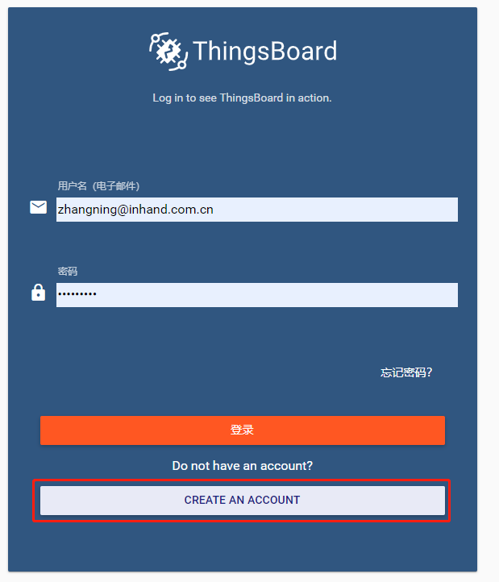  

登录后，进入属性页面修改语言为简体中文。  

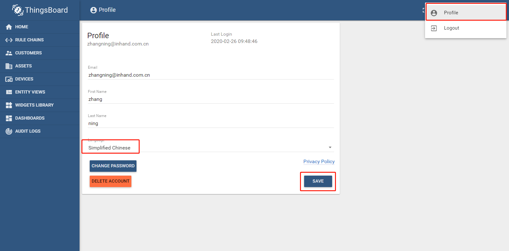

- 添加一个资产  
  
    

    

  添加成功后如下图所示：  

    

- 添加一个设备  
  
    

    

  建立资产与设备的关联。  

    

  添加完成后如下图所示：  

    

<a id="传输plc数据到thingsboard设备"> </a>  
  
#### 传输PLC数据到Thingsboard设备
资产和设备配置完成后，复制已添加设备的访问令牌并粘贴至网关的云服务页面的用户名参数中以将数据传输至Thingsboard中的`S7-1200`设备。  

  

随后可在设备的最新遥测中查看已上传的数据。  


<a id="配置可视化仪表板"> </a>  

#### 配置可视化仪表板

- [添加仪表板](#添加仪表板)
- [添加趋势图](#添加趋势图)
- [添加开关](#添加开关)

<a id="添加仪表板"> </a>  

- 添加仪表板  
  
  点击“添加仪表板”，选择“创建新的仪表板”。在“添加仪表板”配置并添加一个仪表板。  

    

  添加完成后单击仪表板名称并选择“打开仪表板”。  

    

  点击“进入编辑模式”。  

    

  点击“实体别名”为仪表板添加实体别名。  

    

  在“添加别名”页面参考下图进行配置：  

    

  配置完成后保存配置即可。  

    

<a id="添加趋势图"> </a>  

- 添加趋势图  
  
  在仪表板中点击“进入编辑模式”并点击添加新的部件  

  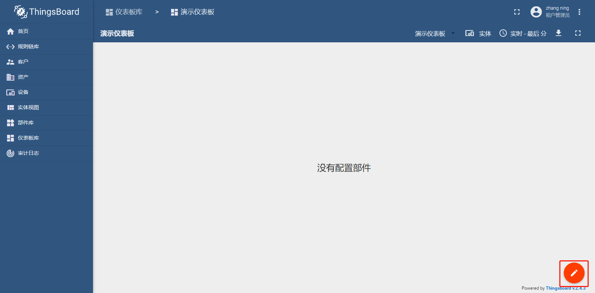  
  
    

  在部件中选择“Charts”并点击“Timeseries-Flot”。  

    

  在图表的“数据”页面为趋势图添加展示数据。  

    

    

  添加完成后如下图所示：  

  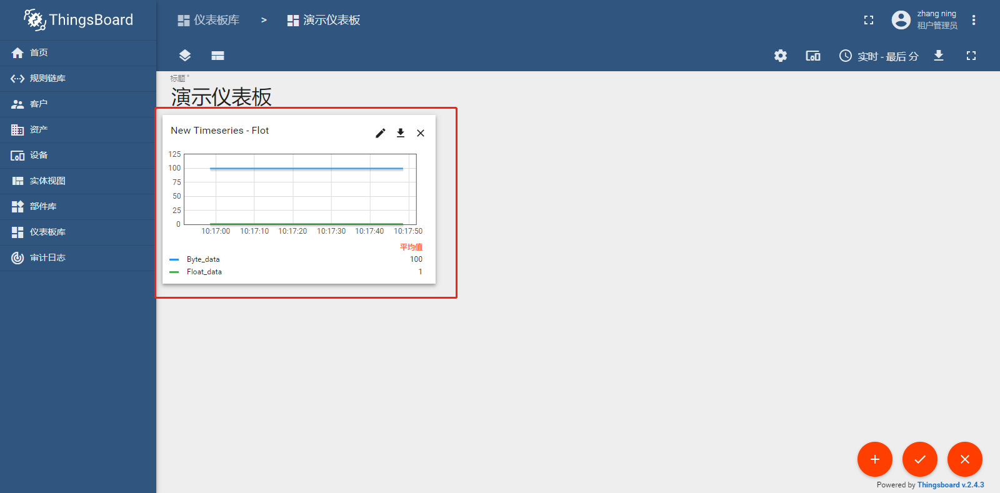

<a id="添加开关"> </a>  

- 添加开关  
  
  点击“添加新的部件”，选择“创建新部件”以添加一个控制开关。  

    

  在部件中选择“Control widgets”并点击“Switch control”。  

    

  随后选择目标设备。  

    

  配置完成后调整部件的大小和布局并保存。  

    

  随后可以通过开关下发控制命令以及通过趋势图查看数据趋势。  

  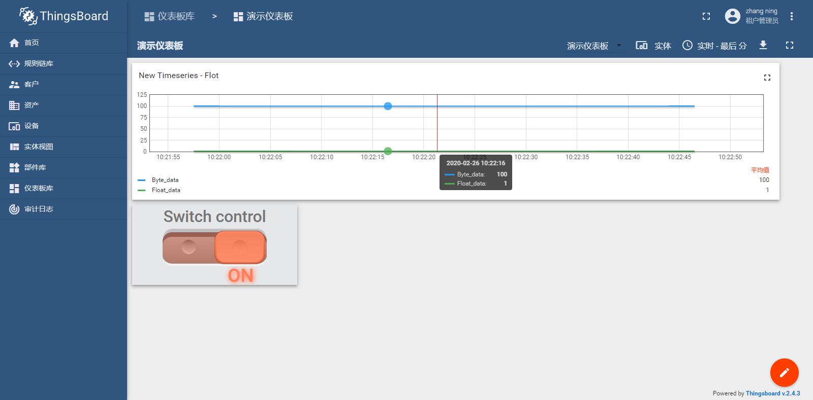  

<a id="FAQ"> </a>  

## FAQ  
- 查看云服务脚本是否正确  
  打开Device Supervisor App日志。脚本编写完成并点击“确定”后，通过日志中的`Build module: <主函数名称>, type: <publish/subscribe>`信息查看脚本是否构建成功。  
  
  脚本构建成功如下图所示：  

    
  
  脚本构建失败如下图所示：  

    

- 查看App的云服务输出是否正确  
  您可以使用使用`logger`和`logging`输出重要日志。下图是在运行脚本中的第6行使用了`logging.info`方法，在日志中可以通过搜索`<string> 6`查看输出结果是否符合预期。  
  
   