# Modbus Example

  - [概述](#概述)
  - [先决条件](#先决条件)
  - [环境准备](#环境准备)
    - [配置Modbus PLC](#配置modbus-plc)
    - [配置开发环境](#配置开发环境)
  - [开始测试](#开始测试)

## 概述
Modbus是master/slave架构的串行通信协议，允许多个设备连接在同一个网络上进行通信。Modbus已经成为工业领域通信协议事实上的业界标准，并且现在是工业电子设备之间常用的连接方式。Modbus比其他通信协议使用的更广泛的主要原因有：
1. 公开发表并且无著作权要求
2. 易于部署和维护
3. 对供应商来说，修改移动本地的比特或字节没有很多限制
 
映翰通提供`modbus`示例以便于客户基于InGateway二次开发实现modbus数据采集。该示例主要基于`modbus_tk`实现了InGateway作为Modbus master通过Modbus TCP和Modbus RTU协议读写Modbus slave的01、02、03和04功能码的Modbus变量，支持的变量类型包括bit、word、string等数据类型。`modbus_tk`的详细使用方法请访问[modbus_tk](https://github.com/ljean/modbus-tk/)。  <font color=#FF0000>注意：请勿同时使用`device_supervisor`和`demo示例`，否则可能导致代码运行异常。</font> 

## 先决条件
在进行开发和测试前，你需要具备以下条件：  
- InGateway  
  - 固件版本：`2.0.0.r12513`及以上（请联系客服获取）  
  - SDK版本：`1.3.5`及以上（请联系客服获取）  
- VS Code软件   
- Modbus PLC（本文档使用施耐德的`TM241` PLC）及其编程软件（`TM241`的编程软件为`SoMachine`） 

## 环境准备

 - [配置Modbus PLC](#配置modbus-plc)  
 - [配置开发环境](#配置开发环境)  

### 配置Modbus PLC
如果你已经配置了相应的Modbus slave，可以跳过这一小节。以下将说明如何配置`TM241`作为Modbus slave以便于后续测试验证。
- 步骤1：建立InGateway与`TM241`连接  
  - Modbus TCP：使用以太网线连接`TM241`与InGateway  
    设置`TM241`与InGateway处于同一网段（IG501的FE 0/1口的默认ip地址为`192.168.1.1`；IG902的GE 0/2口的默认ip地址为`192.168.2.1`），本文档配置`TM241`的IP地址为`10.5.16.155`。  

  - Modbus RTU：使用串口线连接`TM241`与InGateway  
    IG902串口端子接线说明如下图：  
    
    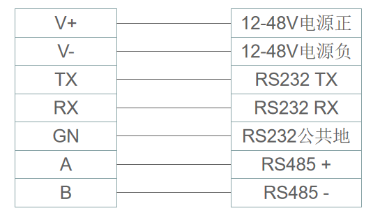  

    IG501串口端子接线说明如下图：  

    

    `TM241`串口端子接线说明请通过PLC说明文档获取。  

- 步骤2：配置`TM241`  

    打开`SoMachine`软件，并点击“新建项目 > 空项目”以创建一个新的项目。

    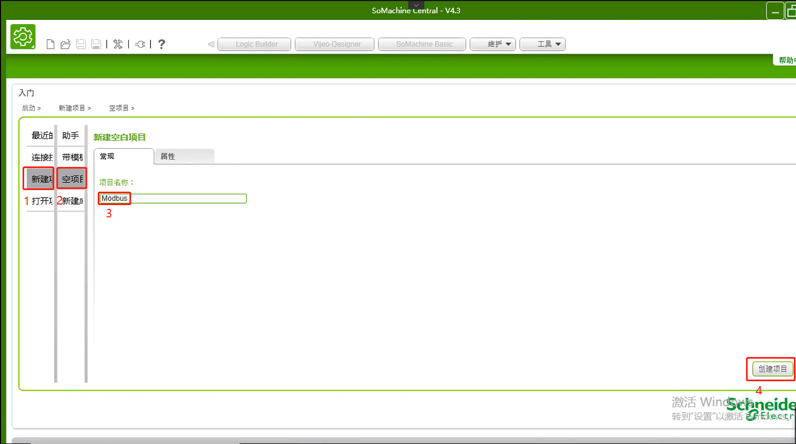  

    随后双击“编程一个或多个控制器”，进入项目视图。

    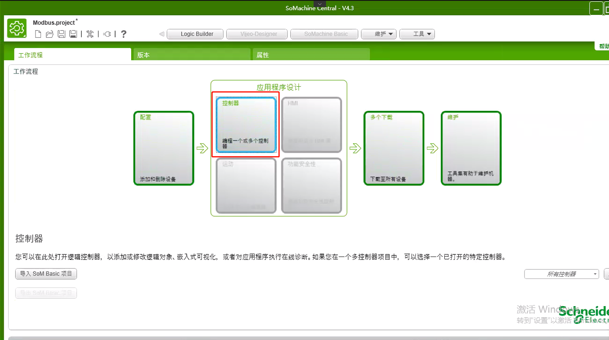  

    选择相应的PLC并添加至“设备树”中。如下图所示：  

    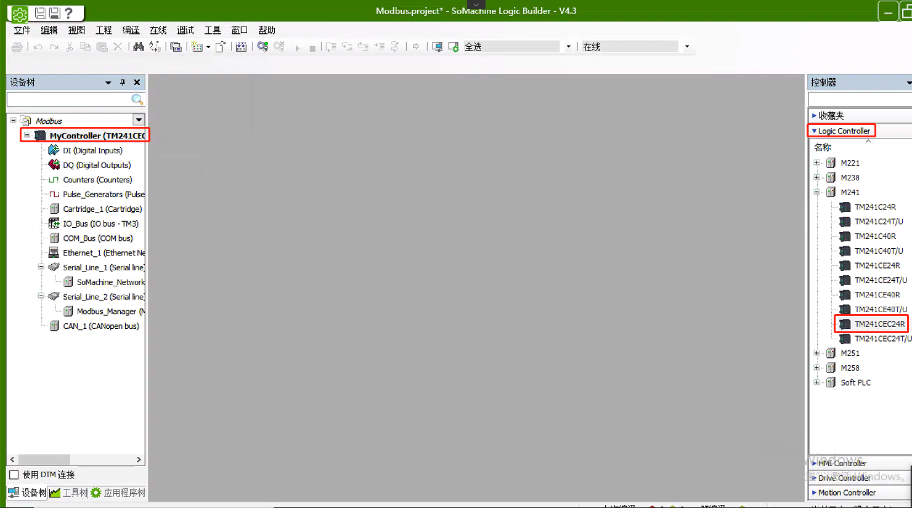 

    在“应用程序树”的“GVL”中添加如下变量：<font color=#FF0000>（`%QX0.0`对应modbus地址为`1`；`%MW0`对应modbus地址为`40001`；`%MW2`对应modbus地址为`40003`）</font>

    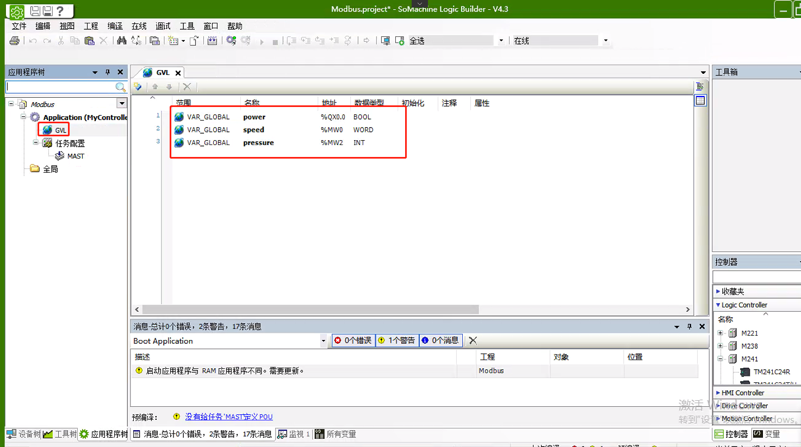  

    右击“Application”，选择“添加对象 > POU”。添加一个“POU”对象，并在“POU”中配置简单的赋值规则。  

    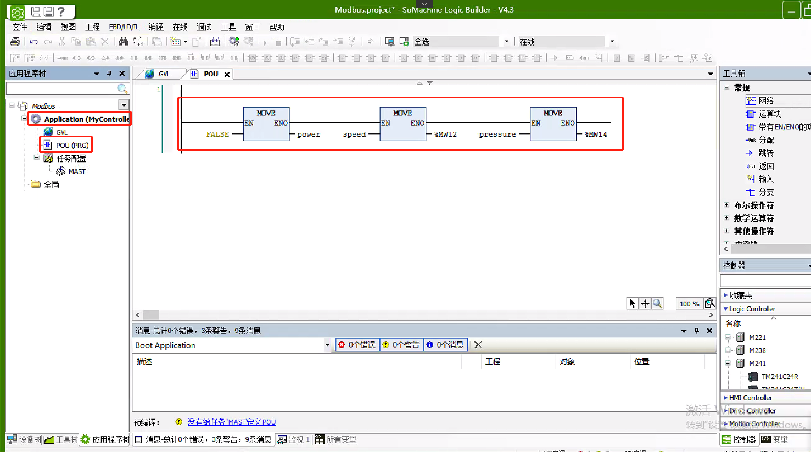  

    右击“MAST”，选择“添加对象 > 程序调用”。添加上一步中创建的“POU”对象并点击“添加”。  

    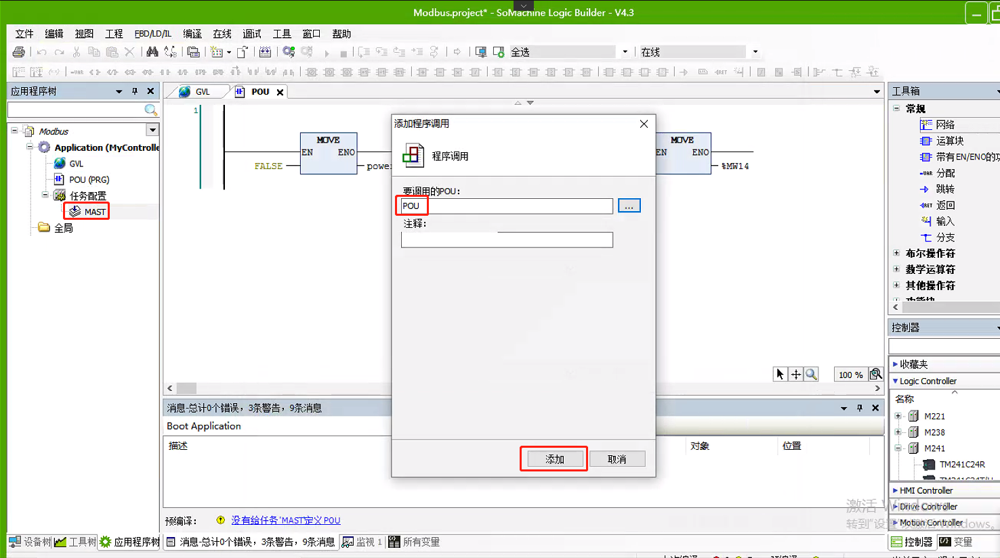  

    - Modbus TCP  
      使用PLC进行Modbus TCP通讯时，在“设备树”的"Ethernet_1"中设置PLC的IP地址（本demo中为`10.5.16.155`）。

      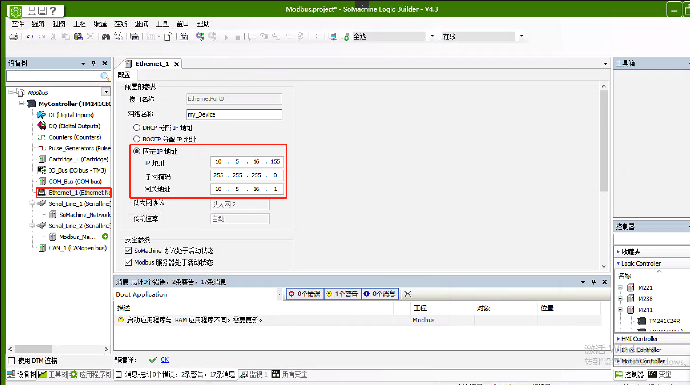

    - Modbus RTU  
      使用PLC进行Modbus RTU通讯时，选择“设备树”中相应的串口并设置串口通讯参数（本demo为`Serial_Line_2`，使用RS485串口通讯）。串口通讯参数需与`modbus_example.py`中的modbus参数一致，见[修改Modbus slave参数](#modify-the-code)。    

      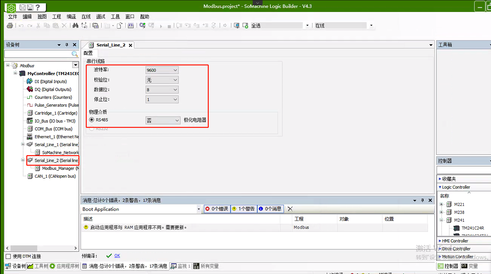  


  配置完毕后双击PLC，在控制器页面中选中需要更新程序的PLC并点击“登录”以下载程序。  

  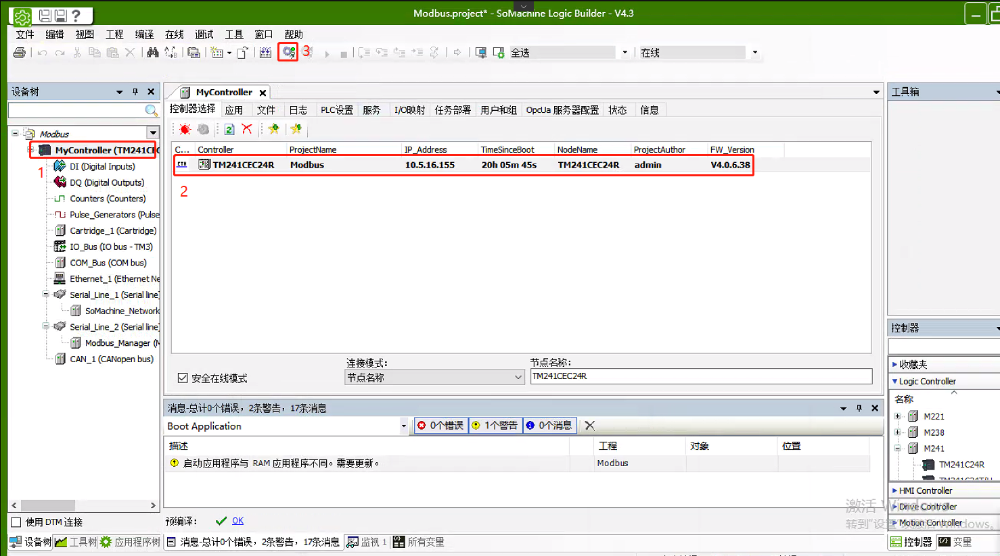  

  下载成功后点击“开始”使PLC开始运行。  

  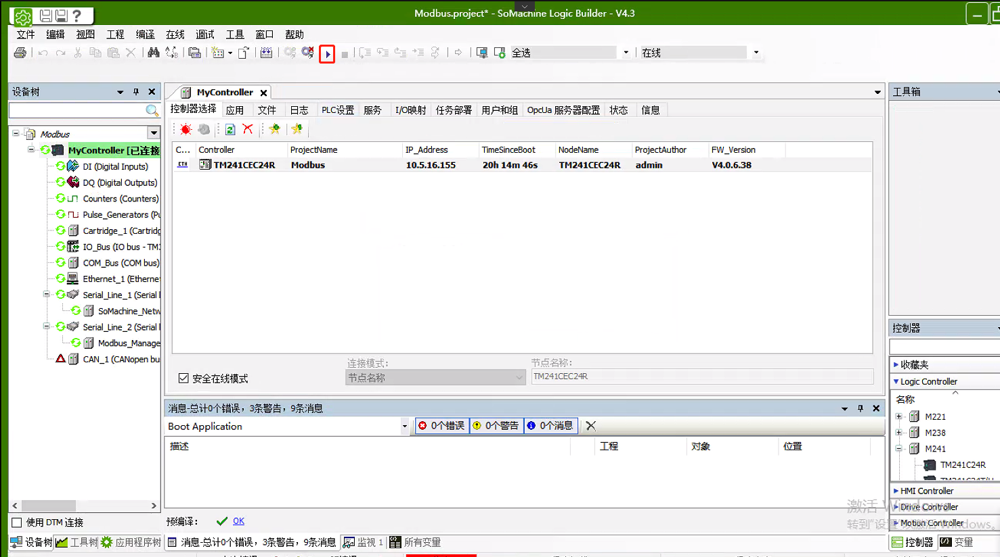

### 配置开发环境  
- [InGateway配置](#gateway-configuration)  
- [建立项目文件夹](#create-project-folder)  

<a id="gateway-configuration"> </a>   

- InGateway配置  
设备联网、软件更新、IDE软件获取等基础的配置操作请查看[MobiusPi Python Development Quick Start](http://doc.ig.inhand.com.cn/zh_CN/latest/QuickStart.html)。以下操作我们将假设你已经完成了InGateway的软件更新、设备联网、开启调试模式等配置。  

<a id="create-project-folder"> </a>  

- 建立项目文件夹  
  建立一个名为“modbus”文件夹作为项目文件夹，最终项目文件夹的结构如下：
  ```
  ├── .vscode
  │  └── sftp.json
  ├── build
  ├── lib
  ├── src
  │  │── main.py
  │  └── modbus_example.py
  └── setup.py
  ```

  - `.vscode`：VS Code配置文件夹  
    - `sftp.json`：与InGateway建立SFTP连接所需的SFTP配置文件。  
  - `build`：App发布包文件夹。  
  - `lib`：App第三方依赖库文件夹。  
  - `src`：App源码文件夹  
    - `main.py`：App入口。  
    - `modbus_example.py`：主要基于`modbus_tk`实现了InGateway作为Modbus master通过Modbus TCP和Modbus RTU协议读写Modbus slave的01、02、03和04功能码的Modbus变量。  
  - `setup.py`：App说明文件。  

  
## 开始测试
- [安装modbus_tk](#installation-modbus-tk)  
- [修改Modbus slave参数](#modify-the-code)  
- [调试代码](#debug-code)  
- [核对数据读写](#check-read-write-data-on-modrssim)  

<a id="installation-modbus-tk"> </a>  

- 步骤1：安装`modbus_tk`  
  建立与InGateway的SFTP连接，操作步骤见[建立SFTP连接](http://doc.ig.inhand.com.cn/zh_CN/latest/QuickStart.html#sftp)。SFTP连接建立成功后在终端执行`pip install modbus_tk --user`安装`modbus_tk`依赖库。  

  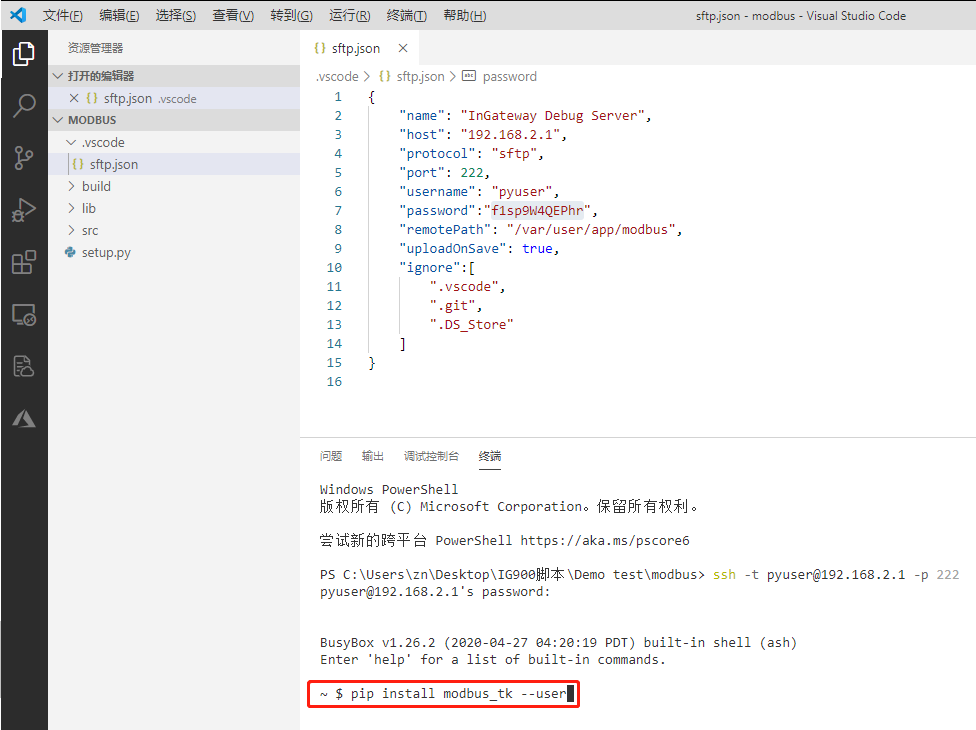  

  安装成功后如下图所示：
  
  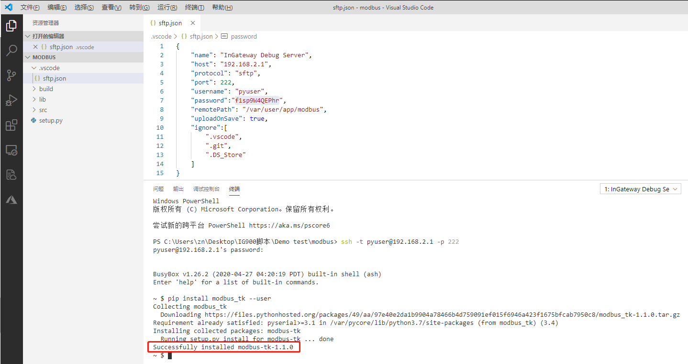

<a id="modify-the-code"> </a> 

- 步骤2：修改Modbus slave参数  
  本demo的默认配置为使用`Modbus TCP`协议采集IP地址为`10.5.16.155`，端口号为`502`，从站地址为`1`，字节序为`cdab`，超时时间`15`秒的Modbus slave中的以下变量数据：
    1. 读取寄存器地址为`1`的`bit`类型的modbus数据，数据名称为`power`
    2. 读取寄存器地址为`40001`的`bit`类型的modbus数据的第三位，数据名称为`model`
    3. 读取寄存器地址为`40001`的`word`类型的modbus数据并写入数值`20`，数据名称为`speed`
    4. 读取寄存器地址为`40003`的`int`类型的modbus数据并写入数值`1234`，数据名称为`pressure` 

  如果你的PLC上中配置了以上modbus地址变量，则可以直接使用demo代码。否则请在`modbus_example.py`中根据你的实际情况调整以下配置：  

  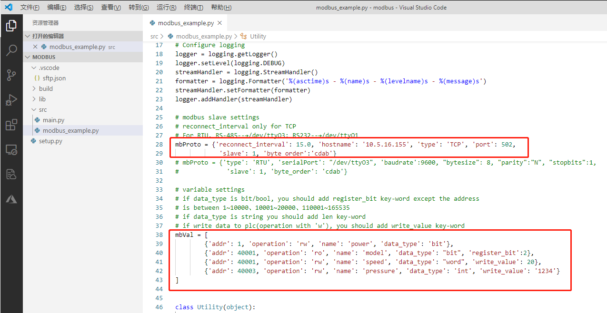  
 
  - `mbProto`（Modbus TCP）  
    - `reconnect_interval`：超时时间  
    - `hostname`：Modbus模拟器或PLC的ip地址  
    - `type`：通讯类型，以太网通讯时为`TCP`  
    - `port`：通讯端口号  
    - `slave`：站地址  
    - `byte_order`：字节序，包括`abcd`、`badc`、`cdab`、`dcba`四种  
  - `mbProto`（Modbus RTU）  
    - `type`：通讯类型，串口通讯时为`RTU`   
    - `serialPort`：串口号，使用RS485串口时为`/dev/tty03`；使用RS232串口时为`/dev/ttyO1`  
    - `baudrate`：波特率  
    - `bytesize`：数据位  
    - `parity`：校验位，无校验为`N` 、偶校验为`E`、奇校验为`O` 
    - `stopbits`：停止位  
    - `slave`：站地址  
    - `byte_order`：字节序，包括`abcd`、`badc`、`cdab`、`dcba`四种  
  - `mbVal`  
    - `addr`：modbus寄存器地址
    - `operation`：可读可写`rw`、只读`ro`、只写`wo`
    - `len`：读写的数据长度,仅对`string`数据类型有效
    - `name`：数据名称
    - `data_type`：数据类型
    - `register_bit`：03和04功能码数据的数据类型为`bit`或`bool`时，通过此项参数设置读取寄存器地址的哪一位。可配置`0-15`中的任意一位
    - `write_value`：当数据可写时，写入该modbus寄存器地址的数值
   

<a id="debug-code"> </a>  

- 步骤3：调试代码   
  如何使用VS Code调试代码请参考[调试代码](http://doc.ig.inhand.com.cn/zh_CN/latest/QuickStart.html#id13)。`main.py`运行结果如下图所示：  
  
  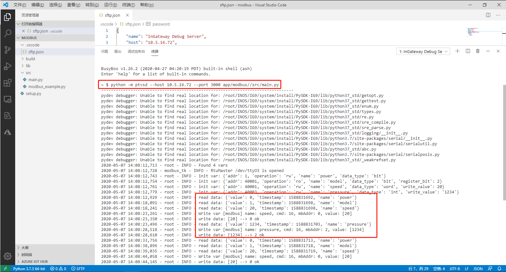  

<a id="check-read-write-data-on-modrssim"> </a> 

- 步骤4：核对数据读写  
  在`SoMachine`软件中登录相应PLC后，进入“应用程序树”的“GVL”页面，查看各变量数值，与代码读取到的数据一致。  

  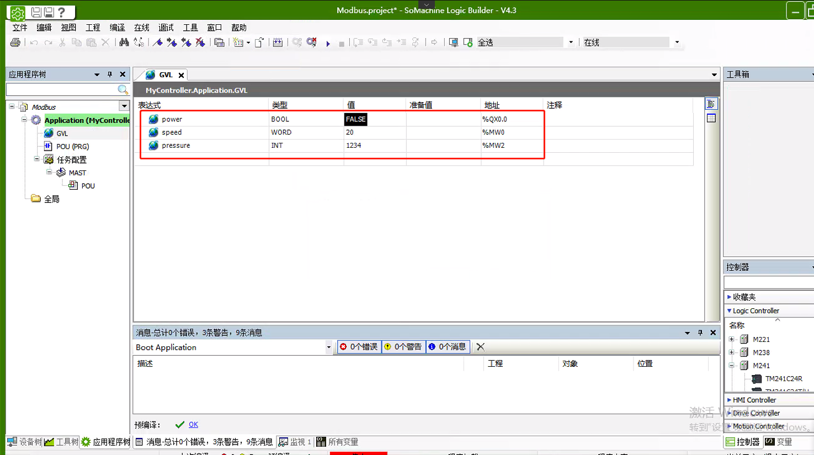  

至此，完成了在InGateway上实现modbus数据采集。